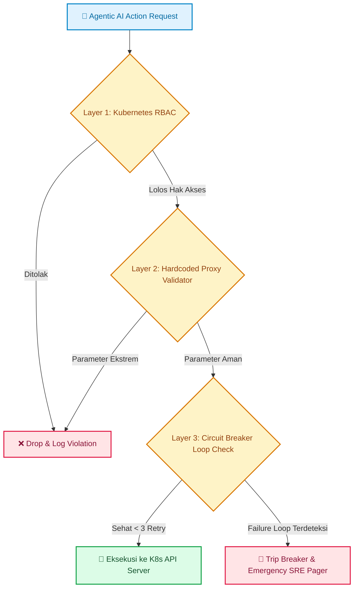

### Menghadapi Risiko Akses Otonom Agen AI

Ketika kita mulai mempercayakan penanganan gangguan (*incident mitigation*) kepada agen AI otonom, mimpi buruk terbesar setiap *Site Reliability Engineer (SRE)* adalah satu: **kehilangan kendali sistem produksi**.

Model bahasa besar (*LLM*) rentan mengalami halusinasi (*prompt injection* atau salah tafsir konteks). Tanpa pagar pembatas yang ketat, perintah perbaikan sederhana bisa berubah menjadi bencana *downtime* massal. 

Oleh karena itu, implementasi **guardrails keamanan Agen AI** di atas klaster Kubernetes produksi (seperti Amazon EKS) bukan lagi opsi tambahan, melainkan syarat mutlak.

---

## Tiga Lapisan Pengamanan Agen AI pada Kubernetes

Di lingkungan produksi yang mengelola multi-klaster EKS, pembatasan instruksi bahasa alami (*system prompt*) terbukti tidak memadai. Agen AI membutuhkan pembatasan berbasis aturan keras (*hardcoded rules*) di tingkat platform.

Berikut arsitektur pengamanan tiga lapis yang teruji:



---

### Lapisan 1: Kubernetes RBAC Minimum (*Least Privilege Principle*)

Langkah awal yang fundamental: **jangan pernah memberikan hak `cluster-admin` kepada *ServiceAccount* agen AI**.

*   **Batasi Ruang Lingkup Namespace**: Karantina akses agen hanya pada *namespace* non-kritis atau beban kerja terisolasi.
*   **Granular Verbs Control**: Berikan izin hanya pada operasi pembacaan (`get`, `list`, `watch`) dan pembaruan terbatas (`update`, `patch` pada sumber daya `deployment`/`pod`). Larang keras verba destruktif (`delete`, `deletecollection`).
*   **Audit Logging Terpusat**: Wajibkan setiap panggilan API dari *ServiceAccount* agen tercatat ke AWS CloudWatch Logs atau Grafana Loki untuk audit kepatuhan keamanan.

---

### Lapisan 2: Validasi Parameter via Hardcoded Proxy

Sebelum instruksi agen AI diteruskan ke server API Kubernetes, sebuah *proxy validator* wajib memeriksa batas parameter secara deterministik.

Misalnya, saat agen mendeteksi lonjakan trafik dan memutuskan menaikkan replika pod:

```python
# Contoh validasi batas aman pada Proxy Validator
def validate_scale_action(target_replicas: int, min_allowed: int = 2, max_allowed: int = 10):
    if not (min_allowed <= target_replicas <= max_allowed):
        raise ValueError(
            f"❌ Permintaan skala ({target_replicas} pod) di luar batas aman [{min_allowed}-{max_allowed}]!"
        )
    return True
```

Dengan validasi deterministik ini, kesalahan kalkulasi model AI tidak akan memicu *scaling loop* yang menghabiskan anggaran komputasi *cloud*.

---

### Lapisan 3: Menghindari Kegagalan Beruntun dengan Circuit Breakers

Agen AI yang terjebak dalam putaran kegagalan (*failure loop*) dapat memperburuk keparahan insiden. Jika agen mencoba memulihkan pod yang *crash* tetapi gagal hingga 3 kali berturut-turut:

1. Fitur **Circuit Breaker** otomatis memutus hak eksekusi agen seketika.
2. Status pemutusan memicu eskalasi darurat (*high-priority paging*) ke saluran Slack atau PagerDuty tim SRE.
3. Kendali sistem dialihkan 100% kepada manusia (*Human Takeover*).

---

## Langkah Taktis yang Bisa Diterapkan

Untuk mengamankan agen otonom di atas klaster Kubernetes produksi, terapkan empat langkah proteksi terprogram berikut:

1. **Terapkan RBAC dengan Prinsip Hak Minimum (*Least Privilege*)**: Batasi *service account* agen AI hanya pada operasi baca (`get`, `list`) dan pembaruan terbatas (`update`) pada *namespace* non-kritis, tanpa pernah memberikan wewenang `cluster-admin` atau hak hapus (`delete`).
2. **Bangun Lapisan Validasi Aturan Keras (*Hardcoded Validator Proxy*)**: Tempatkan layanan perantara untuk memvalidasi batas parameter (seperti batas minimal-maksimal replika pod atau kapasitas memori) sebelum perintah mencapai Kubernetes API server.
3. **Pasang Pemutus Sirkuit Otomatis (*Circuit Breaker*)**: Batasi frekuensi aksi perbaikan agen; jika mitigasi gagal tiga kali berturut-turut, bekukan akses otonom seketika dan kirimkan notifikasi darurat ke saluran Slack tim on-call SRE.
4. **Sentralisasi Jejak Audit (*Immutable Audit Logs*)**: Catat setiap panggilan API, input instruksi, dan keputusan mitigasi agen ke sistem pemantauan terpusat untuk keperluan forensik dan evaluasi pasca-insiden.

> "Di lingkungan produksi, probabilitas model AI wajib tunduk pada kepastian deterministik. Pagar pengaman bukan penghambat inovasi, melainkan fondasi kepercayaan bagi sistem otonom."

---

### Diskusikan Pengamanan Sistem Anda

Bagaimana tim Anda mengamankan sistem otomatisasi dan agen AI saat ini? Apakah sudah menerapkan pembatasan hak akses di level API, atau masih mengandalkan instruksi teks (*system prompt*) semata? Mari berbagi wawasan di kolom komentar!

---

<div class="english-corner p-4 my-6 rounded-lg bg-surface-secondary border border-border-subtle">
  <div class="font-bold text-text-primary mb-2">💡 Pojok Bahasa Inggris</div>
  <ul class="text-sm space-y-1 text-text-secondary">
    <li><strong>Least Privilege</strong>: Prinsip keamanan siber yang hanya memberikan hak akses minimum yang mutlak diperlukan untuk menyelesaikan tugas tertentu.</li>
    <li><strong>Circuit Breaker</strong>: Mekanisme proteksi perangkat lunak yang otomatis menghentikan operasi berulang saat mendeteksi ambang batas kegagalan sistem.</li>
  </ul>
</div>

---

[← Kembali ke Daftar Artikel]({{ '/blog/' | relative_url }})
