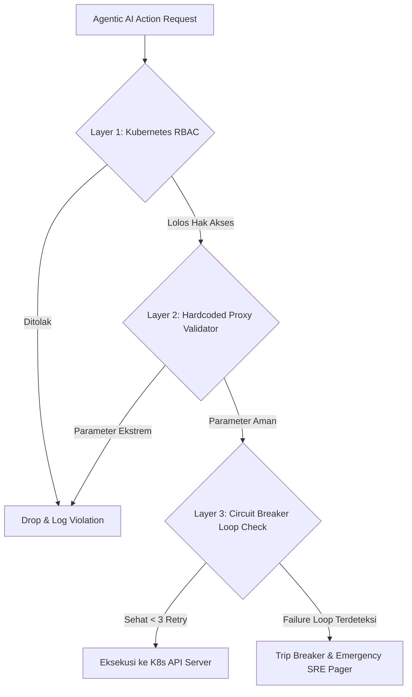

### Menghadapi Risiko Akses Otonom Agen AI

Ketika kita mulai mempercayakan penanganan gangguan (*incident mitigation*) kepada agen AI otonom, mimpi buruk terbesar setiap *Site Reliability Engineer (SRE)* adalah satu: **kehilangan kendali sistem produksi**.

Model bahasa besar (*LLM*) rentan mengalami halusinasi (*prompt injection* atau salah tafsir konteks). Tanpa pagar pembatas yang ketat, perintah perbaikan sederhana bisa berubah menjadi bencana *downtime* massal. 

Oleh karena itu, implementasi **guardrails keamanan Agen AI** di atas klaster Kubernetes produksi (seperti Amazon EKS) bukan lagi opsi tambahan, melainkan syarat mutlak.

---

## Tiga Lapisan Pengamanan Agen AI pada Kubernetes

Di lingkungan produksi yang mengelola multi-klaster EKS, pembatasan instruksi bahasa alami (*system prompt*) terbukti tidak memadai. Agen AI membutuhkan pembatasan berbasis aturan keras (*hardcoded rules*) di tingkat platform.

Berikut arsitektur pengamanan tiga lapis yang teruji:



---

### Lapisan 1: Kubernetes RBAC Minimum (*Least Privilege Principle*)

Langkah awal yang fundamental: **jangan pernah memberikan hak `cluster-admin` kepada *ServiceAccount* agen AI**.

*   **Batasi Ruang Lingkup Namespace**: Karantina akses agen hanya pada *namespace* non-kritis atau beban kerja terisolasi.
*   **Granular Verbs Control**: Berikan izin hanya pada operasi pembacaan (`get`, `list`, `watch`) dan pembaruan terbatas (`update`, `patch` pada sumber daya `deployment`/`pod`). Larang keras verba destruktif (`delete`, `deletecollection`).
*   **Audit Logging Terpusat**: Wajibkan setiap panggilan API dari *ServiceAccount* agen tercatat ke AWS CloudWatch Logs atau Grafana Loki untuk audit kepatuhan keamanan.

---

### Lapisan 2: Validasi Parameter via Hardcoded Proxy

Sebelum instruksi agen AI diteruskan ke server API Kubernetes, sebuah *proxy validator* wajib memeriksa batas parameter secara deterministik.

Misalnya, saat agen mendeteksi lonjakan trafik dan memutuskan menaikkan replika pod:

```python
# Contoh validasi batas aman pada Proxy Validator
def validate_scale_action(target_replicas: int, min_allowed: int = 2, max_allowed: int = 10):
    if not (min_allowed <= target_replicas <= max_allowed):
        raise ValueError(
            f"❌ Permintaan skala ({target_replicas} pod) di luar batas aman [{min_allowed}-{max_allowed}]!"
        )
    return True
```

Dengan validasi deterministik ini, kesalahan kalkulasi model AI tidak akan memicu *scaling loop* yang menghabiskan anggaran komputasi *cloud*.

---

### Lapisan 3: Menghindari Kegagalan Beruntun dengan Circuit Breakers

Agen AI yang terjebak dalam putaran kegagalan (*failure loop*) dapat memperburuk keparahan insiden. Jika agen mencoba memulihkan pod yang *crash* tetapi gagal hingga 3 kali berturut-turut:

1. Fitur **Circuit Breaker** otomatis memutus hak eksekusi agen seketika.
2. Status pemutusan memicu eskalasi darurat (*high-priority paging*) ke saluran Slack atau PagerDuty tim SRE.
3. Kendali sistem dialihkan 100% kepada manusia (*Human Takeover*).

---

## Rangkuman Aksi & Klimaks Filosofis

Keandalan infrastruktur modern tidak dibangun di atas rasa percaya buta terhadap kecerdasan buatan, melainkan di atas keandalan sistem pengaman yang membungkusnya.

Mendelegasikan penanganan insiden kepada sistem otonom adalah langkah besar menuju efisiensi operasional. Namun, ingat prinsip dasar rekayasa sistem:

**"Otonomi tanpa guardrails adalah kelalaian fatal. Sebaliknya, guardrails tanpa otonomi adalah kemunduran birokrasi. Bangun pagar yang kokoh, lalu biarkan agen bekerja dengan tenang."**

---

### Bagikan & Diskusikan
Bagaimana pendekatan tim Anda dalam mengamankan hak akses otomatisasi di Kubernetes?
- 📤 **Bagikan panduan keamanan ini** ke rekan engineer di tim Anda.
- 💡 Pelajari desain pembagian wewenang selengkapnya di [Mendesain Alur Kerja Agentic AI]({{ '/2026/08/16/mendesain-alur-kerja-agentic-ai/' | relative_url }}).
- 💬 Diskusikan arsitektur *guardrails* Anda di kolom komentar di bawah!

---

<div style="background-color: #1E293B; color: #F8FAFC; padding: 12px; border-radius: 8px; border-left: 4px solid #38BDF8;">
<strong>💡 Pojok Bahasa Inggris</strong><br>
1. <strong>Guardrail</strong>: <em>Pagar pengaman / Batas proteksi</em> — mekanisme kontrol teknis terprogram yang membatasi tindakan sistem otonom agar tetap berada dalam koridor aman.<br>
2. <strong>Circuit Breaker</strong>: <em>Pemutus sirkuit</em> — pola desain perangkat lunak yang secara otomatis menghentikan eksekusi operasi yang gagal berulang kali untuk mencegah kerusakan sistem yang lebih luas.
</div>
