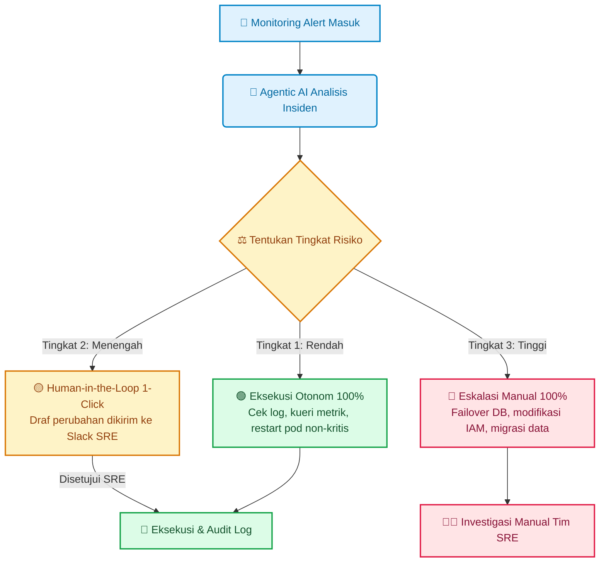

### Dilema Delegasi Kontrol pada Agen AI

Sebagai *Site Reliability Engineer (SRE)* yang mengelola klaster produksi, kita selalu menghadapi dilema klasik otomatisasi: **kita ingin memangkas waktu pemulihan insiden (*MTTR*), tetapi kita takut kehilangan kendali sistem**.

Membiarkan model AI mengeksekusi perubahan konfigurasi atau modifikasi basis data secara otonom tanpa batasan jelas adalah mimpi buruk. Namun, jika setiap keputusan kecil harus menunggu persetujuan berantai manajemen, seluruh keunggulan kecepatan AI akan hilang seketika.

Tantangan utamanya adalah: **bagaimana mendesain alur kerja Agentic AI dengan mendelegasikan wewenang keputusan (*decision authority*) secara bertingkat dan aman?**

---

## Pergeseran Paradigma: Dari Chatbot Pasif ke Agen Otonom

Sistem berbasis agen (*Agentic AI*) tidak sekadar menghasilkan teks; mereka **mengambil tindakan nyata** menggunakan perkakas (*tools*) seperti terminal SSH, API konektor, atau skrip Terraform.

| Parameter | Generative AI Tradisional | Agentic AI (Sistem Berbasis Agen) |
| :--- | :--- | :--- |
| **Model Interaksi** | Tanya-jawab pasif (*single-turn*) | Mandiri menyelesaikan alur kerja multi-langkah |
| **Bentuk Output** | Draf teks, saran kode, ringkasan | Aksi nyata (API calls, mutasi konfigurasi, eksekusi skrip) |
| **Tingkat Akses** | Terisolasi tanpa akses infrastruktur | Terhubung dengan *environment* melalui API berizin |
| **Fokus Utama** | Menyajikan informasi | Menyelesaikan tugas operasional (*outcome-driven*) |

---

## Matriks Delegasi Otoritas Tiga Tingkat

Untuk menyeimbangkan kecepatan dan stabilitas, bagi seluruh tindakan operasional ke dalam **Tiga Tingkat Risiko Otoritas**:

---

### Tingkat 1: Tindakan Otonom Bebas Risiko (*Fully Autonomous*)
*   **Ruang Lingkup**: Operasi hanya-baca (*read-only*) dan tindakan remidiasi sederhana yang telah teruji aman di *runbook*.
*   **Contoh Aksi**: Mengambil log dari Grafana Loki, mengecek status pod Kubernetes, membersihkan *cache* sementara, atau me-restart pod *stateless* yang gagal.
*   **Otoritas**: 100% otonom. Agen mengeksekusi aksi dan mencatat hasilnya di tiket insiden.

---

### Tingkat 2: Otorisasi Satu Klik (*Human-in-the-Loop Approval*)
*   **Ruang Lingkup**: Tindakan yang mengubah alokasi sumber daya atau berpotensi memengaruhi sebagian kecil pengguna.
*   **Contoh Aksi**: Mengubah replika pod (*scaling*), membersihkan antrean Redis, atau memperbarui batas memori pod.
*   **Otoritas**: Agen menyusun ringkasan akar masalah beserta draf perintah mitigasi, lalu mengirimkan tombol persetujuan (*1-click approval*) ke saluran Slack tim SRE. Begitu disetujui, agen mengeksekusinya.

---

### Tingkat 3: Rekomendasi Murni Tanpa Akses Eksekusi (*Manual Escalation*)
*   **Ruang Lingkup**: Tindakan kritis yang berpotensi menyebabkan kegagalan sistem katastropik atau pemborosan biaya besar.
*   **Contoh Aksi**: *Failover* basis data utama (Aurora RDS), penghapusan volume penyimpanan, atau modifikasi izin IAM *cloud*.
*   **Otoritas**: 0% eksekusi otomatis. Agen hanya bertindak sebagai asisten investigasi yang menyajikan data analisis, sementara eksekusi dilakukan sepenuhnya oleh teknisi senior.

---

## Langkah Taktis yang Bisa Diterapkan

Untuk mendelegasikan wewenang operasional kepada sistem agen pintar secara aman, terapkan empat langkah berikut:

1. **Petakan Matriks Otoritas Bertingkat (*Tiered Authority*)**: Kategorikan setiap aksi operasional ke dalam Tingkat 1 (*Advisory*), Tingkat 2 (*Human-in-the-Loop*), atau Tingkat 3 (*Fully Autonomous*) berdasarkan dampak risikonya terhadap sistem.
2. **Integrasikan Gerbang Persetujuan Satu Klik (*Interactive HITL*)**: Hubungkan agen AI dengan platform komunikasi tim (seperti Slack atau Discord via *webhook*) agar insinyur dapat menyetujui atau menolak draf mitigasi berisiko sedang dalam hitungan detik.
3. **Terapkan Pembatasan Laju Terprogram (*Programmatic Rate Limiting*)**: Pasang pembatas frekuensi eksekusi dan kuota perubahan pada aksi Tingkat 3 guna mencegah terjadinya efek bola salju (*cascading failure*) akibat kegagalan berulang.
4. **Evaluasi Akurasi Mitigasi Berkala (*Continuous Feedback Loop*)**: Tinjau riwayat eksekusi agen secara rutin; naikkan wewenang dari *Advisory* ke *Autonomous* hanya setelah akurasi mitigasi mencapai ambang batas yang terbukti stabil.

> "Mendelegasikan tugas ke mesin bukan berarti melepaskan akuntabilitas manusia. Otomasi terbaik adalah kemitraan di mana mesin menyediakan kecepatan dan manusia memegang kendali penilaian akhir."

---

### Diskusikan Kesiapan Sistem Anda

Bagaimana dengan sistem di organisasi Anda saat ini? Apakah Anda sudah siap mendelegasikan tindakan mitigasi otomatis ke AI, atau masih berada di tahap eksplorasi wacana? Mari kita diskusikan di kolom komentar!

---

  
💡 Pojok Bahasa Inggris

  <ul class="text-sm space-y-1 text-text-secondary">
    <li><strong>Human-in-the-Loop (HITL)</strong>: Model operasional di mana otomatisasi memerlukan verifikasi atau intervensi manusia pada titik keputusan krusial.</li>
    <li><strong>Autonomous Agent</strong>: Perangkat lunak berbasis AI yang mampu merencanakan langkah mandiri dan mengeksekusi aksi secara otomatis untuk mencapai tujuan tertentu.</li>
  </ul>

---

[← Kembali ke Daftar Artikel]({{ '/blog/' | relative_url }})
