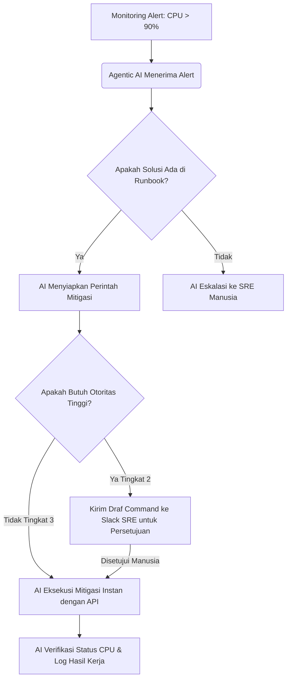

### Dilema Delegasi Kontrol pada Agen AI

Sebagai *site reliability engineer / SRE* (rekayasa keandalan situs) yang mengelola infrastruktur lima *cluster* EKS di Lion Parcel, saya sering menghadapi dilema otomatisasi. Di satu sisi, kita ingin meminimalkan intervensi manual saat insiden terjadi. Di sisi lain, membiarkan mesin mengambil tindakan sendiri tanpa kontrol yang ketat adalah mimpi buruk operasional.

Pada artikel sebelumnya tentang [Alur Kerja AI: Mengapa AI Tidak Memperbaiki Proses Rusak]({{ '/2026/08/14/ai-tidak-menyelesaikan-alur-kerja-yang-rusak/' | relative_url }}), kita membahas hambatan terbesar dalam otomatisasi, yaitu **Otoritas**.

Banyak organisasi ragu memberikan kebebasan bagi sistem agen pintar untuk mengeksekusi keputusan secara langsung. Ketakutan ini sangat logis. Membiarkan AI mengubah konfigurasi *cloud* atau memodifikasi database produksi tanpa pengawasan manusia bisa memicu insiden fatal.

Namun, jika setiap rekomendasi AI harus melalui birokrasi persetujuan manual yang lambat, efisiensi teknologi tersebut akan hilang. Tantangan besarnya adalah bagaimana **mendesain alur kerja Agentic AI** dengan mendelegasikan wewenang keputusan (*decision authority*) secara aman tanpa kehilangan kendali atas sistem kita.

---

## Pergeseran Paradigma dari Chatbot ke Agen Otonom

Sistem agen pintar tidak hanya berpikir; mereka bertindak. Mereka menggunakan *tools* (seperti terminal, konektor API, atau skrip otomatisasi) untuk mencapai tujuan yang didefinisikan oleh manusia. Karena kemampuan eksekusi ini, desain otorisasi menjadi sangat krusial.

Perbedaan mendasar antara *generative AI* biasa dan sistem berbasis agen terletak pada eksekusi tindakan:

| Karakteristik | Generative AI Tradisional | Agentic AI (Berbasis Agen) |
|---|---|---|
| **Interaksi** | Tanya-jawab satu arah (*single-turn*) | Mandiri menyelesaikan tugas multi-langkah |
| **Output** | Teks, gambar, atau kode program | Aksi nyata (API call, edit berkas, jalankan perintah) |
| **Otoritas** | Tidak memiliki akses ke sistem | Memiliki akses terkontrol untuk berinteraksi dengan *tools* |
| **Fokus** | Memberikan informasi | Menyelesaikan alur kerja (*workflow*) |

---

## Menentukan Struktur Otoritas Bertingkat untuk Agen AI

Untuk membagi tingkat risiko dari setiap tindakan yang akan dieksekusi ke dalam sistem, kita harus menetapkan kerangka kerja pembagian tingkat otonomi agen AI. Dengan pembagian ini, kita menjaga keseimbangan antara kecepatan operasional dan keamanan sistem.

<figure>
  
  <figcaption>Otoritas bertingkat memastikan koordinasi delegasi wewenang AI tetap berada dalam batas kendali operasional.</figcaption>
</figure>

### Tingkat 1: Advisory (Saran) — Risiko Rendah
*   **Wewenang**: AI hanya membaca data (*read-only*) dan memberikan rekomendasi kepada staf manusia.
*   **Contoh Kasus**: AI mendeteksi anomali penggunaan memori server pada kontainer Kubernetes dan menyarankan pembersihan *cache* berkala.
*   **Kontrol**: Manusia memverifikasi dan mengeksekusi rekomendasi secara manual.

### Tingkat 2: Human-in-the-Loop (Persetujuan Manusia) — Risiko Sedang
*   **Wewenang**: AI menyusun draf aksi dan menyiapkan perintah yang diperlukan, tetapi eksekusi akhir membutuhkan konfirmasi satu klik dari manusia.
*   **Contoh Kasus**: Menulis draf skrip perbaikan konfigurasi *load balancer* yang bermasalah. Manusia hanya perlu meninjau kode di Slack dan menekan tombol *Proceed* (Lanjutkan).
*   **Kontrol**: Gerbang persetujuan (*approval gate*) mencegah eksekusi perintah berbahaya akibat halusinasi AI.

### Tingkat 3: Fully Autonomous with Guardrails (Otonom Berpagar) — Risiko Tinggi
*   **Wewenang**: AI mengeksekusi keputusan secara instan tanpa menunggu persetujuan manusia, namun dibatasi oleh parameter ketat.
*   **Contoh Kasus**: Melakukan *auto-scaling* (penambahan kapasitas server) secara otomatis saat trafik naik tajam, dengan batas maksimal penambahan sebanyak dua server per jam.
*   **Kontrol**: Sistem *rate limiting* dan *circuit breaker* (pemutus sirkuit otomatis) terpasang kuat di level infrastruktur.

---

## Membangun Pagar Pengaman Sistem Secara Terprogram

Ketika mendelegasikan wewenang kepada Agentic AI pada Tingkat 3, Anda wajib membangun *guardrails* secara terprogram. Jangan pernah berasumsi bahwa AI akan selalu bertindak benar berdasarkan instruksi bahasa alami saja.

1.  **Gunakan Prinsip Least Privilege (Hak Akses Minimum)**:
    Jangan memberikan akses administrator penuh (*root access*) pada akun *cloud* atau database kepada agen AI. Berikan akses API token yang hanya diizinkan melakukan tugas spesifik, seperti melakukan *restart* kontainer, bukan menghapus *cluster* Kubernetes.
2.  **Validasi Output dengan Aturan Keras (Hardcoded Rules)**:
    Sebelum perintah dikirim ke sistem produksi, jalankan skrip validasi tradisional untuk memeriksa rentang nilai. Jika AI mencoba menaikkan ukuran kapasitas penyimpanan server secara berlebihan, sistem harus langsung membatalkan perintah tersebut dan memicu peringatan (*alert*).
3.  **Implementasikan Circuit Breakers**:
    Batasi frekuensi tindakan agen AI. Jika agen melakukan kesalahan berulang, matikan wewenang otonomnya secara otomatis dan alihkan kendali sepenuhnya ke staf manusia.

---

## Implementasi Otomatisasi Mitigasi Alert untuk SRE

Mari kita terapkan konsep ini pada tim SRE yang menangani mitigasi alert server:

Melalui alur di atas, tim SRE tidak perlu terganggu di tengah malam hanya untuk menangani masalah berulang yang solusinya sudah jelas. Di sisi lain, untuk keputusan yang berisiko merusak sistem, kendali tetap berada di tangan manusia via otorisasi satu klik.

---

## Cara Menyeimbangkan Kecepatan dan Keamanan Otomasi

Mendelegasikan otoritas kepada Agentic AI bukan berarti membiarkan sistem berjalan tanpa aturan. Kunci sukses dari otomatisasi modern adalah memperlakukan kecerdasan buatan seperti karyawan baru yang sedang magang: beri mereka akses terbatas, tinjau hasil kerjanya, tingkatkan wewenangnya secara berkala seiring dengan meningkatnya akurasi sistem, dan pasang pagar pengaman yang kokoh di sekitar mereka.

Dengan menata alur kerja delegasi secara bertahap, Anda dapat melipatgandakan kecepatan operasional organisasi Anda tanpa perlu mengorbankan stabilitas sistem.

---

**Bagaimana dengan sistem di organisasi Anda?**

Apakah Anda sudah siap mendelegasikan tindakan otomatis ke AI, atau masih berada di tahap eksplorasi wacana? Mari kita diskusikan di kolom komentar!

---

[← Kembali ke Daftar Artikel]({{ '/blog/' | relative_url }})
