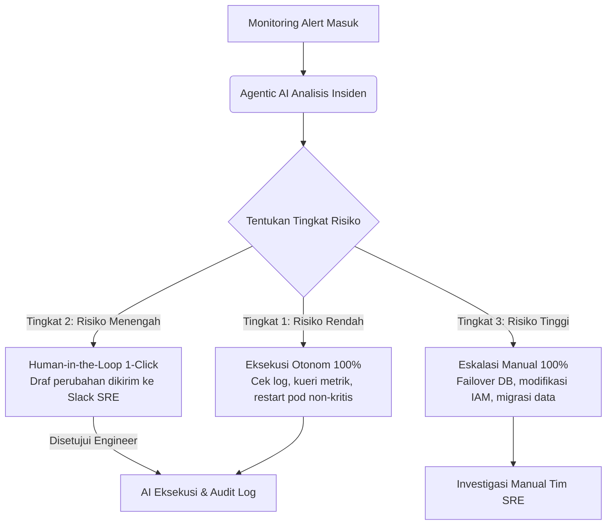

### Dilema Delegasi Kontrol pada Agen AI

Sebagai *Site Reliability Engineer (SRE)* yang mengelola klaster produksi, kita selalu menghadapi dilema klasik otomatisasi: **kita ingin memangkas waktu pemulihan insiden (*MTTR*), tetapi kita takut kehilangan kendali sistem**.

Membiarkan model AI mengeksekusi perubahan konfigurasi atau modifikasi basis data secara otonom tanpa batasan jelas adalah mimpi buruk. Namun, jika setiap keputusan kecil harus menunggu persetujuan berantai manajemen, seluruh keunggulan kecepatan AI akan hilang seketika.

Tantangan utamanya adalah: **bagaimana mendesain alur kerja Agentic AI dengan mendelegasikan wewenang keputusan (*decision authority*) secara bertingkat dan aman?**

---

## Pergeseran Paradigma: Dari Chatbot Pasif ke Agen Otonom

Sistem berbasis agen (*Agentic AI*) tidak sekadar menghasilkan teks; mereka **mengambil tindakan nyata** menggunakan perkakas (*tools*) seperti terminal SSH, API konektor, atau skrip Terraform.

| Parameter | Generative AI Tradisional | Agentic AI (Sistem Berbasis Agen) |
| :--- | :--- | :--- |
| **Model Interaksi** | Tanya-jawab pasif (*single-turn*) | Mandiri menyelesaikan alur kerja multi-langkah |
| **Bentuk Output** | Draf teks, saran kode, ringkasan | Aksi nyata (API calls, mutasi konfigurasi, eksekusi skrip) |
| **Tingkat Akses** | Terisolasi tanpa akses infrastruktur | Terhubung dengan *environment* melalui API berizin |
| **Fokus Utama** | Menyajikan informasi | Menyelesaikan tugas operasional (*outcome-driven*) |

---

## Matriks Delegasi Otoritas Tiga Tingkat

Untuk menyeimbangkan kecepatan dan stabilitas, bagi seluruh tindakan operasional ke dalam **Tiga Tingkat Risiko Otoritas**:

---

### Tingkat 1: Tindakan Otonom Bebas Risiko (*Fully Autonomous*)
*   **Ruang Lingkup**: Operasi hanya-baca (*read-only*) dan tindakan remidiasi sederhana yang telah teruji aman di *runbook*.
*   **Contoh Aksi**: Mengambil log dari Grafana Loki, mengecek status pod Kubernetes, membersihkan *cache* sementara, atau me-restart pod *stateless* yang gagal.
*   **Otoritas**: 100% otonom. Agen mengeksekusi aksi dan mencatat hasilnya di tiket insiden.

---

### Tingkat 2: Otorisasi Satu Klik (*Human-in-the-Loop Approval*)
*   **Ruang Lingkup**: Tindakan yang mengubah alokasi sumber daya atau berpotensi memengaruhi sebagian kecil pengguna.
*   **Contoh Aksi**: Mengubah replika pod (*scaling*), membersihkan antrean Redis, atau memperbarui batas memori pod.
*   **Otoritas**: Agen menyusun ringkasan akar masalah beserta draf perintah mitigasi, lalu mengirimkan tombol persetujuan (*1-click approval*) ke saluran Slack tim SRE. Begitu disetujui, agen mengeksekusinya.

---

### Tingkat 3: Rekomendasi Murni Tanpa Akses Eksekusi (*Manual Escalation*)
*   **Ruang Lingkup**: Tindakan kritis yang berpotensi menyebabkan kegagalan sistem katastropik atau pemborosan biaya besar.
*   **Contoh Aksi**: *Failover* basis data utama (Aurora RDS), penghapusan volume penyimpanan, atau modifikasi izin IAM *cloud*.
*   **Otoritas**: 0% eksekusi otomatis. Agen hanya bertindak sebagai asisten investigasi yang menyajikan data analisis, sementara eksekusi dilakukan sepenuhnya oleh teknisi senior.

---

## Rangkuman Aksi & Klimaks Filosofis

Otomatisasi berbasis *Agentic AI* bukanlah tombol saklar biner yang langsung diubah dari nol ke seratus persen. 

Kunci sukses adopsi teknologi ini adalah memperlakukan agen AI seperti **insinyur magang dengan kecepatan komputasi super**:
1. Beri mereka akses pembacaan yang luas untuk belajar dan mendiagnosis.
2. Uji konsistensi rekomendasinya melalui mekanisme persetujuan satu klik (*Human-in-the-Loop*).
3. Naikkan tingkat otonominya secara bertahap seiring terbuktinya keandalan sistem.

**"Kecepatan tanpa kendali adalah kehancuran. Kendali tanpa kecepatan adalah stagnasi. Bangun alur kerja bertingkat, dan raih keduanya secara presisi."**

---

### Bagikan & Diskusikan
Bagaimana organisasi Anda merancang batas otonomi untuk otomatisasi sistem?
- 📤 **Bagikan wawasan ini** kepada tim platform dan arsitek sistem Anda.
- 🛡️ Pelajari proteksi lapis platform di [Guardrails Keamanan Agen AI di EKS]({{ '/2026/08/16/membangun-guardrails-keamanan-agen-ai-eks/' | relative_url }}).
- 💬 Sampaikan pandangan dan strategi Anda di kolom komentar di bawah!

---

<strong>💡 Pojok Bahasa Inggris</strong> 
1. <strong>Outcome-driven</strong>: <em>Berorientasi pada hasil akhir</em> — pendekatan otomatisasi yang berfokus pada penyelesaian target tugas secara utuh, bukan sekadar memberikan teks respons. 
2. <strong>Failover</strong>: <em>Pengalihan kegagalan otomatis</em> — mekanisme peralihan operasional sistem dari node/peladen yang rusak ke node cadangan yang siaga tanpa menghentikan layanan.

