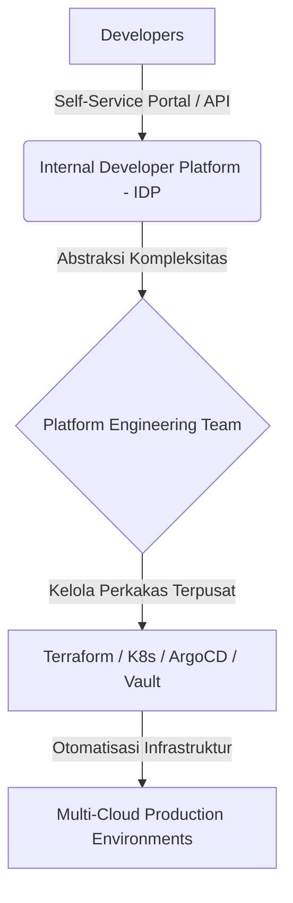

### Dilema Kompleksitas Tooling DevOps Hari Ini

Jika Anda bekerja di bidang rekayasa perangkat lunak atau infrastruktur beberapa tahun lalu, hidup terasa jauh lebih sederhana. Seorang *DevOps engineer* (rekayasa DevOps) hanya membutuhkan empat pilar utama: menulis kode (*code*), membangun aplikasi (*build*), merilis sistem (*deploy*), dan mengelola server (*servers*). Cukup dengan bash script sederhana, server Jenkins, dan beberapa virtual machine, sistem sudah berjalan dengan andal.

Namun hari ini, lanskap tersebut telah berubah drastis menjadi labirin perkakas yang membingungkan. 

Dari manajemen repositori (*Git*), kontainerisasi (*Docker*), orkestrasi (*Kubernetes*), infrastruktur sebagai kode (*Terraform*, *Ansible*), hingga pemantauan sistem (*Prometheus*, *Grafana*, *ELK*), jumlah teknologi yang harus dikuasai melonjak secara eksponensial. Keadaan ini menciptakan fenomena *cognitive overload* (kelebihan beban kognitif) yang luar biasa bagi para engineer. Kita menghabiskan lebih banyak waktu untuk menyambungkan berbagai alat daripada menulis kode yang memberikan nilai nyata bagi bisnis.

---

## Mengapa Tooling Overload Bisa Terjadi?

Ledakan ekosistem teknologi awan (*cloud-native ecosystem*) menawarkan solusi untuk setiap masalah kecil. Namun, kemudahan ini memicu tren buruk: menimbun perkakas (*tool hoarding*). Beberapa faktor pemicu utamanya meliputi:

1. **Sindrom FOMO Teknis (Fear of Missing Out)**:
   Kekhawatiran dianggap tertinggal jika tidak menggunakan teknologi terbaru yang sedang tren di komunitas global.
2. **Ketiadaan Standarisasi Platform**:
   Setiap tim pengembangan dibiarkan memilih alat masing-masing tanpa adanya koordinasi terpusat. Akibatnya, satu organisasi bisa menggunakan tiga sistem CI/CD berbeda secara bersamaan.
3. **Mengabaikan Proses Demi Alat**:
   Asumsi keliru bahwa membeli atau memasang alat baru akan otomatis memperbaiki alur kerja yang berantakan.

Hal ini sejalan dengan apa yang kita bahas pada artikel tentang [Alur Kerja AI: Mengapa AI Tidak Memperbaiki Proses Rusak]({{ '/2026/08/14/ai-tidak-menyelesaikan-alur-kerja-yang-rusak/' | relative_url }}). Memaksakan alat canggih di atas proses kerja yang cacat hanya akan mempercepat terjadinya kegagalan.

---

## Dampak Buruk Fragmentasi Alat Terhadap Tim

Kelebihan jumlah alat tidak serta-merta meningkatkan produktivitas. Sebaliknya, fragmentasi ini memicu hambatan operasional:

| Dampak | Deskripsi | Konsekuensi Nyata |
|---|---|---|
| **Cognitive Overload** | Engineer harus memahami puluhan sintaksis, konfigurasi YAML, dan konsep CLI berbeda. | Kelelahan mental (*burnout*) dan peningkatan kesalahan konfigurasi (*misconfiguration*). |
| **Silo Informasi** | Metrik kinerja sistem tersebar di berbagai dasbor yang terisolasi satu sama lain. | Waktu pelacakan masalah (*Mean Time to Resolution / MTTR*) menjadi sangat lambat saat insiden terjadi. |
| **Pengeboman Notifikasi** | Setiap alat mengirimkan peringatan (*alert fatigue*) ke saluran komunikasi tim. | Peringatan kritis terabaikan karena tercampur dengan puluhan notifikasi sampah. |

---

## Solusi Nyata: Transisi Menuju Platform Engineering

Bagaimana cara keluar dari jebakan kompleksitas ini? Jawabannya bukan dengan membuang semua alat, melainkan dengan menyembunyikan kompleksitas tersebut dari para pengembang aplikasi melalui disiplin **Platform Engineering** (rekayasa platform).

Tim rekayasa platform bertugas membangun *Internal Developer Platform / IDP* (platform internal pengembang). IDP berfungsi sebagai lapisan abstraksi yang membungkus puluhan alat rumit tadi. Pengembang aplikasi tidak perlu lagi menulis ribuan baris manifes Kubernetes atau Terraform dari awal. Mereka cukup berinteraksi dengan portal mandiri (*self-service portal*) sederhana untuk meluncurkan infrastruktur baru yang sudah memenuhi standar keamanan dan kepatuhan organisasi.

---

## DevOps adalah Budaya, Bukan Sekadar Perkakas

Kembali ke esensi dasarnya, DevOps bukanlah tentang menguasai ratusan logo teknologi. Seperti yang sering digaungkan oleh para perintis industri: **DevOps adalah budaya kolaborasi, otomatisasi, dan peningkatan berkelanjutan secara konsisten**.

Alat hanyalah sarana pembantu (*enabler*). Jika tim Anda memiliki komunikasi yang buruk, penerapan Kubernetes tercanggih sekalipun tidak akan bisa menyelamatkan proyek Anda dari kegagalan rilis.

Untuk memangkas tumpukan alat di organisasi Anda, mulailah dengan tiga langkah taktis berikut:

1. **Lakukan Audit Tooling**: Identifikasi alat yang memiliki fungsi tumpang tindih dan konsolidasikan fungsinya (misalnya, pilih satu alat pemantauan terpusat).
2. **Standardisasikan Golden Paths**: Buat jalur rilis standar yang terintegrasi penuh untuk meminimalkan beban keputusan dari tim pengembang.
3. **Fokus pada Hasil Akhir**: Ukur kesuksesan berdasarkan metrik DORA (seperti frekuensi rilis dan tingkat kegagalan perubahan), bukan dari jumlah alat yang berhasil diintegrasikan.

Dengan menyederhanakan tumpukan teknologi, kita dapat mengembalikan fokus utama para engineer untuk menciptakan inovasi produk berkualitas tinggi secara cepat dan aman.

---

**Bagaimana kondisi tumpukan perkakas di tim Anda saat ini?**

Apakah Anda merasa kewalahan dengan jumlah konfigurasi YAML yang harus diurus setiap hari, atau sudah berhasil menyederhanakannya melalui rekayasa platform? Mari bagikan pengalaman Anda di kolom komentar!

---

[← Kembali ke Daftar Artikel]({{ '/blog/' | relative_url }})
