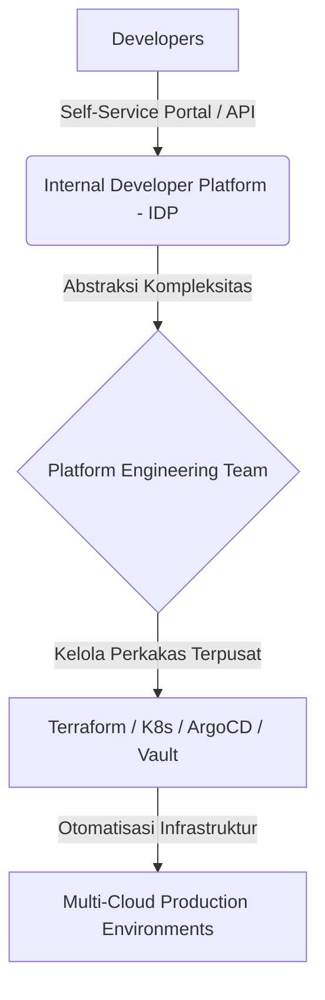

### Dilema Kompleksitas Tooling DevOps Hari Ini

Jika Anda bekerja di bidang rekayasa perangkat lunak atau infrastruktur beberapa tahun lalu, hidup terasa jauh lebih sederhana. Seorang *DevOps engineer* (rekayasa DevOps) hanya membutuhkan empat pilar utama: menulis kode (*code*), membangun aplikasi (*build*), merilis sistem (*deploy*), dan mengelola server (*servers*). Cukup dengan bash script sederhana, server Jenkins, dan beberapa virtual machine, sistem sudah berjalan dengan andal.

Namun hari ini, lanskap tersebut telah berubah drastis menjadi labirin perkakas yang membingungkan. 

Dari manajemen repositori (*Git*), kontainerisasi (*Docker*), orkestrasi (*Kubernetes*), infrastruktur sebagai kode (*Terraform*, *Ansible*), hingga pemantauan sistem (*Prometheus*, *Grafana*, *ELK*), jumlah teknologi yang harus dikuasai melonjak secara eksponensial. Keadaan ini menciptakan fenomena *cognitive overload* (kelebihan beban kognitif) yang luar biasa bagi para engineer. Kita menghabiskan lebih banyak waktu untuk menyambungkan berbagai alat daripada menulis kode yang memberikan nilai nyata bagi bisnis.

<figure>
  
  <figcaption>Perbandingan realitas DevOps 8 tahun lalu dengan kompleksitas perkakas hari ini.</figcaption>
</figure>

---

## Mengapa Tooling Overload Bisa Terjadi?

Ledakan ekosistem teknologi awan (*cloud-native ecosystem*) menawarkan solusi untuk setiap masalah kecil. Namun, kemudahan ini memicu tren buruk: menimbun perkakas (*tool hoarding*). Beberapa faktor pemicu utamanya meliputi:

1. **Sindrom FOMO Teknis (Fear of Missing Out)**:
   Kekhawatiran dianggap tertinggal jika tidak menggunakan teknologi terbaru yang sedang tren di komunitas global.
2. **Ketiadaan Standarisasi Platform**:
   Setiap tim pengembangan dibiarkan memilih alat masing-masing tanpa adanya koordinasi terpusat. Akibatnya, satu organisasi bisa menggunakan tiga sistem CI/CD berbeda secara bersamaan.
3. **Mengabaikan Proses Demi Alat**:
   Asumsi keliru bahwa membeli atau memasang alat baru akan otomatis memperbaiki alur kerja yang berantakan.

Hal ini sejalan dengan apa yang kita bahas pada artikel tentang [Alur Kerja AI: Mengapa AI Tidak Memperbaiki Proses Rusak]({{ '/2026/08/14/ai-tidak-menyelesaikan-alur-kerja-yang-rusak/' | relative_url }}). Memaksakan alat canggih di atas proses kerja yang cacat hanya akan mempercepat terjadinya kegagalan.

---

## Dampak Buruk Fragmentasi Alat Terhadap Tim

Kelebihan jumlah alat tidak serta-merta meningkatkan produktivitas. Sebaliknya, fragmentasi ini memicu hambatan operasional:

| Dampak | Deskripsi | Konsekuensi Nyata |
|---|---|---|
| **Cognitive Overload** | Engineer harus memahami puluhan sintaksis, konfigurasi YAML, dan konsep CLI berbeda. | Kelelahan mental (*burnout*) dan peningkatan kesalahan konfigurasi (*misconfiguration*). |
| **Silo Informasi** | Metrik kinerja sistem tersebar di berbagai dasbor yang terisolasi satu sama lain. | Waktu pelacakan masalah (*Mean Time to Resolution / MTTR*) menjadi sangat lambat saat insiden terjadi. |
| **Pengeboman Notifikasi** | Setiap alat mengirimkan peringatan (*alert fatigue*) ke saluran komunikasi tim. | Peringatan kritis terabaikan karena tercampur dengan puluhan notifikasi sampah. |

---

## Solusi Nyata: Transisi Menuju Platform Engineering

Bagaimana cara keluar dari jebakan kompleksitas ini? Jawabannya bukan dengan membuang semua alat, melainkan dengan menyembunyikan kompleksitas tersebut dari para pengembang aplikasi melalui disiplin **Platform Engineering** (rekayasa platform).

Tim rekayasa platform bertugas membangun *Internal Developer Platform / IDP* (platform internal pengembang). IDP berfungsi sebagai lapisan abstraksi yang membungkus puluhan alat rumit tadi. Pengembang aplikasi tidak perlu lagi menulis ribuan baris manifes Kubernetes atau Terraform dari awal. Mereka cukup berinteraksi dengan portal mandiri (*self-service portal*) sederhana untuk meluncurkan infrastruktur baru yang sudah memenuhi standar keamanan dan kepatuhan organisasi.

---

## Langkah Taktis yang Bisa Diterapkan

Untuk memangkas tumpukan perkakas dan mengatasi kelelahan kognitif (*cognitive overload*) pada tim rekayasa Anda, terapkan empat langkah berikut:

1. **Audit Total Ekosistem Perkakas (*Tooling Audit*)**: Petakan seluruh alat yang digunakan lintas tim, eliminasi perkakas yang fungsinya tumpang tindih, dan konsolidasikan rujukan utama (misal: satu platform observabilitas terpusat).
2. **Bangun Jalur Emas Mandiri (*Golden Paths via IDP*)**: Sediakan *Internal Developer Platform* dengan template infrastruktur siap pakai agar pengembang aplikasi dapat merilis layanan tanpa harus menulis ribuan baris manifes Kubernetes atau Terraform dari nol.
3. **Ukur Kinerja Berdasarkan Metrik DORA**: Jadikan indikator keluaran riil—seperti frekuensi deployment (*Deployment Frequency*) dan waktu pemulihan insiden (*Mean Time to Recovery / MTTR*)—sebagai tolok ukur kesuksesan, bukan banyaknya logo teknologi yang diadopsi.
4. **Prioritaskan Budaya Kolaborasi di Atas Perkakas**: Bangun kebiasaan komunikasi transparan dan penyelarasan alur kerja antar-tim sebelum memutuskan untuk membeli atau memasang alat otomatisasi baru.

> "Perkakas hanyalah sarana pembantu, bukan tujuan. Menguasai ratusan logo teknologi tidak berarti apa-apa jika tim gagal berkolaborasi dan merilis nilai bisnis secara konsisten."

---

### Diskusikan Kondisi Tim Anda

Bagaimana kondisi tumpukan perkakas di organisasi Anda saat ini? Apakah Anda merasa kewalahan dengan jumlah konfigurasi YAML yang harus diurus setiap hari, atau sudah berhasil menyederhanakannya melalui rekayasa platform? Mari bagikan pengalaman Anda di kolom komentar!

---

  
💡 Pojok Bahasa Inggris

  <ul class="text-sm space-y-1 text-text-secondary">
    <li><strong>Cognitive Overload</strong>: Kondisi di mana beban informasi dan kompleksitas perkakas melebihi kapasitas pemrosesan mental seorang engineer.</li>
    <li><strong>Golden Path</strong>: Jalur terstandarisasi dan teruji yang disediakan tim platform untuk memudahkan pengembang membangun serta merilis aplikasi secara aman.</li>
  </ul>

---

[← Kembali ke Daftar Artikel]({{ '/blog/' | relative_url }})
