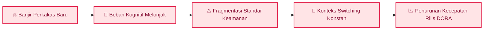
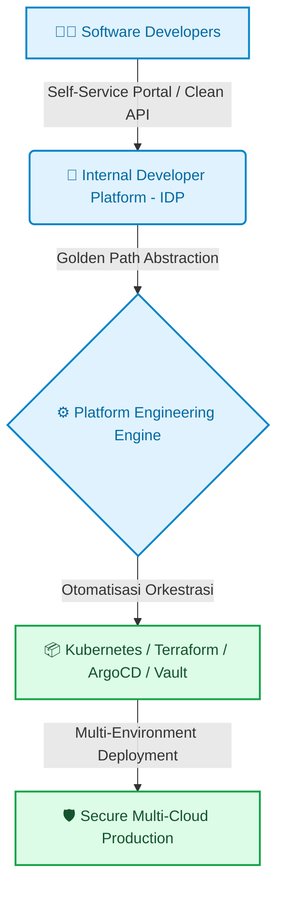

### Terjebak dalam Labirin Lanskap Cloud Native

Buka lanskap *Cloud Native Computing Foundation (CNCF)* hari ini, dan Anda akan melihat ribuan logo alat yang saling bersaing. Mulai dari orkestrasi kontainer, *service mesh*, *GitOps*, *observability*, hingga manajemen rahasia (*secret management*).

Yang awalnya dirancang untuk mempermudah rilis aplikasi, kini berbalik menjadi jebakan baru: **kelelahan kognitif (*cognitive overload*) bagi para pengembang perangkat lunak**.

Alih-alih fokus menulis logika bisnis berkualitas tinggi, para *software engineer* kini dipaksa menjadi pakar konfigurasi YAML, mengurus ratusan baris manifes Kubernetes, dan mengutak-atik *pipeline* CI/CD yang terfragmentasi.

---

## Fenomena Tooling Fatigue: Mengapa Lebih Banyak Alat Memperlambat Tim

Banyak organisasi mengira bahwa mengadopsi setiap perkakas (*tooling*) terbaru akan otomatis meningkatkan kedewasaan DevOps mereka. Di lapangan, tumpukan alat yang berlebihan justru memicu tiga dampak buruk berikut:

1. **Beban Kognitif Berlebih (*Cognitive Overload*)**: Pengembang menghabiskan hingga 30% waktu kerja hanya untuk memahami sintaks konfigurasi infrastruktur dan aturan lingkungan *deployment*.
2. **Konteks Switching Tanpa Henti**: Berpindah-pindah antara 10 dasbor berbeda (monitoring, log, security scanner, deployment console) memecah konsentrasi mendalam (*flow state*).
3. **Mimpi Buruk Pemeliharaan (*Maintenance Overhead*)**: Memperbarui dependensi, sertifikat, dan plugin dari puluhan alat berbeda menyedot kapasitas tim *DevOps/SRE* dari tugas-tugas strategis.

---

## Solusi Nyata: Mengadopsi Platform Engineering & Internal Developer Platform (IDP)

Jalan keluar dari krisis ini bukan dengan menambah perkakas baru, melainkan dengan **membangun lapisan abstraksi yang rapi melalui Rekayasa Platform (*Platform Engineering*)**.

Tim *Platform Engineering* bertugas memperlakukan infrastruktur sebagai produk internal dengan membangun *Internal Developer Platform (IDP)*:

### Konsep "Golden Paths" (Jalur Emas)
Platform Engineering menyediakan **Golden Paths**—jalur rilis terstandarisasi, aman, dan siap pakai dengan opini arsitektur yang jelas.

*   Pengembang yang ingin membuat *microservice* baru cukup memilih *template* di portal mandiri (*self-service portal*).
*   Repositori kode, *pipeline* CI/CD, manifes Kubernetes, sertifikat TLS, dan *dashboard* monitoring otomatis terkonfigurasi sesuai standar keamanan organisasi dalam hitungan detik.

---

## Langkah Taktis yang Bisa Diterapkan

Untuk memangkas tumpukan perkakas dan mengatasi kelelahan kognitif (*cognitive overload*) pada tim rekayasa Anda, terapkan empat langkah berikut:

1. **Audit Total Ekosistem Perkakas (*Tooling Audit*)**: Petakan seluruh alat yang digunakan lintas tim, eliminasi perkakas yang fungsinya tumpang tindih, dan konsolidasikan rujukan utama (misal: satu platform observabilitas terpusat).
2. **Bangun Jalur Emas Mandiri (*Golden Paths via IDP*)**: Sediakan *Internal Developer Platform* dengan template infrastruktur siap pakai agar pengembang aplikasi dapat merilis layanan tanpa harus menulis ribuan baris manifes Kubernetes atau Terraform dari nol.
3. **Ukur Kinerja Berdasarkan Metrik DORA**: Jadikan indikator keluaran riil—seperti frekuensi deployment (*Deployment Frequency*) dan waktu pemulihan insiden (*Mean Time to Recovery / MTTR*)—sebagai tolok ukur kesuksesan, bukan banyaknya logo teknologi yang diadopsi.
4. **Prioritaskan Budaya Kolaborasi di Atas Perkakas**: Bangun kebiasaan komunikasi transparan dan penyelarasan alur kerja antar-tim sebelum memutuskan untuk membeli atau memasang alat otomatisasi baru.

> "Perkakas hanyalah sarana pembantu, bukan tujuan. Menguasai ratusan logo teknologi tidak berarti apa-apa jika tim gagal berkolaborasi dan merilis nilai bisnis secara konsisten."

### Diskusikan Kondisi Tim Anda

Bagaimana kondisi tumpukan perkakas di organisasi Anda saat ini? Apakah Anda merasa kewalahan dengan jumlah konfigurasi YAML yang harus diurus setiap hari, atau sudah berhasil menyederhanakannya melalui rekayasa platform? Mari bagikan pengalaman Anda di kolom komentar!

---

  
💡 Pojok Bahasa Inggris

  <ul class="text-sm space-y-1 text-text-secondary">
    <li><strong>Cognitive Overload</strong>: Kondisi di mana beban informasi dan kompleksitas perkakas melebihi kapasitas pemrosesan mental seorang engineer.</li>
    <li><strong>Golden Path</strong>: Jalur terstandarisasi dan teruji yang disediakan tim platform untuk memudahkan pengembang membangun serta merilis aplikasi secara aman.</li>
  </ul>

---

## Referensi & Bacaan Lanjutan

* [Team Topologies: Organizing Business and Technology Teams for Fast Flow](https://teamtopologies.com/)
* [CNCF Platform Engineering Whitepaper](https://tag-app-delivery.cncf.io/whitepapers/platform-eng/)
* [DORA Research: State of DevOps and Developer Productivity](https://dora.dev/)
* [Gartner: Platform Engineering as a Top Strategic Technology Trend](https://www.gartner.com/en/articles/what-is-platform-engineering)

---

[← Kembali ke Daftar Artikel]({{ '/blog/' | relative_url }})
