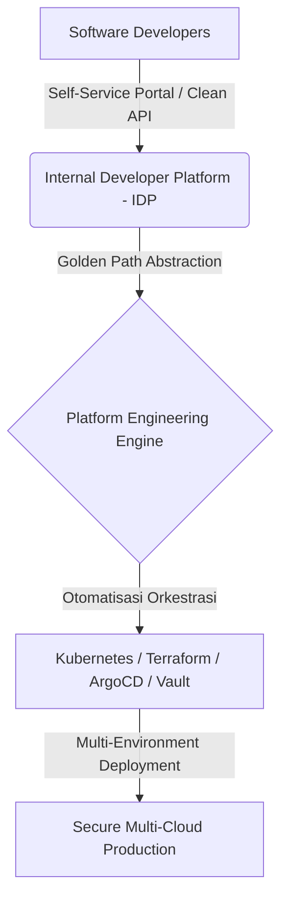

### Terjebak dalam Labirin Lanskap Cloud Native

Buka lanskap *Cloud Native Computing Foundation (CNCF)* hari ini, dan Anda akan melihat ribuan logo alat yang saling bersaing. Mulai dari orkestrasi kontainer, *service mesh*, *GitOps*, *observability*, hingga manajemen rahasia (*secret management*).

Yang awalnya dirancang untuk mempermudah rilis aplikasi, kini berbalik menjadi jebakan baru: **kelelahan kognitif (*cognitive overload*) bagi para pengembang perangkat lunak**.

Alih-alih fokus menulis logika bisnis berkualitas tinggi, para *software engineer* kini dipaksa menjadi pakar konfigurasi YAML, mengurus ratusan baris manifes Kubernetes, dan mengutak-atik *pipeline* CI/CD yang terfragmentasi.

---

## Fenomena Tooling Fatigue: Mengapa Lebih Banyak Alat Memperlambat Tim

Banyak organisasi mengira bahwa mengadopsi setiap perkakas (*tooling*) terbaru akan otomatis meningkatkan kedewasaan DevOps mereka. Di lapangan, tumpukan alat yang berlebihan justru memicu tiga dampak buruk berikut:

1. **Beban Kognitif Berlebih (*Cognitive Overload*)**: Pengembang menghabiskan hingga 30% waktu kerja hanya untuk memahami sintaks konfigurasi infrastruktur dan aturan lingkungan *deployment*.
2. **Konteks Switching Tanpa Henti**: Berpindah-pindah antara 10 dasbor berbeda (monitoring, log, security scanner, deployment console) memecah konsentrasi mendalam (*flow state*).
3. **Mimpi Buruk Pemeliharaan (*Maintenance Overhead*)**: Memperbarui dependensi, sertifikat, dan plugin dari puluhan alat berbeda menyedot kapasitas tim *DevOps/SRE* dari tugas-tugas strategis.

---

## Solusi Nyata: Mengadopsi Platform Engineering & Internal Developer Platform (IDP)

Jalan keluar dari krisis ini bukan dengan menambah perkakas baru, melainkan dengan **membangun lapisan abstraksi yang rapi melalui Rekayasa Platform (*Platform Engineering*)**.

Tim *Platform Engineering* bertugas memperlakukan infrastruktur sebagai produk internal dengan membangun *Internal Developer Platform (IDP)*:

### Konsep "Golden Paths" (Jalur Emas)
Platform Engineering menyediakan **Golden Paths**—jalur rilis terstandarisasi, aman, dan siap pakai dengan opini arsitektur yang jelas.

*   Pengembang yang ingin membuat *microservice* baru cukup memilih *template* di portal mandiri (*self-service portal*).
*   Repositori kode, *pipeline* CI/CD, manifes Kubernetes, sertifikat TLS, dan *dashboard* monitoring otomatis terkonfigurasi sesuai standar keamanan organisasi dalam hitungan detik.

---

## Tiga Langkah Taktis Memangkas Kompleksitas Tooling

Untuk mengembalikan efisiensi tim tanpa merusak stabilitas operasional:

1. **Lakukan Audit & Eliminasi Tumpang Tindih (*Tooling Rationalization*)**: Identifikasi alat yang memiliki fungsi serupa. Standarisasikan satu alat monitoring terpusat dan satu alat CI/CD utama di seluruh organisasi.
2. **Ukur Berdasarkan Metrik DORA, Bukan Jumlah Alat**: Evaluasi keberhasilan tim menggunakan empat metrik kunci: *Deployment Frequency*, *Lead Time for Changes*, *Change Failure Rate*, dan *Time to Restore Service (MTTR)*.
3. **Perlakukan Platform sebagai Produk (*Platform as a Product*)**: Dengarkan keluhan pengembang internal, kumpulkan umpan balik secara berkala, dan rancang portal yang membuat pekerjaan mereka lebih mudah.

---

## Rangkuman Aksi & Klimaks Filosofis

DevOps bukanlah tentang berapa banyak logo teknologi yang Anda pasang di arsitektur sistem Anda. 

**"DevOps adalah budaya kolaborasi dan kecepatan delivering value. Alat hanyalah instrumen pembantu. Jika komunikasi tim rusak, arsitektur Kubernetes tercanggih di dunia tidak akan pernah bisa menyelamatkan rilis Anda dari kegagalan."**

Sederhanakan tumpukan perkakas Anda. Bangun *Golden Paths* yang mulus. Biarkan para insinyur kembali fokus menciptakan inovasi terbaik bagi pengguna.

---

### Bagikan & Diskusikan
Apakah tim Anda sedang berjuang menghadapi kerumitan tumpukan alat DevOps?
- 📤 **Bagikan artikel ini** ke rekan tim dan komunitas engineering Anda.
- 📊 Pelajari kuantifikasi keandalan sistem di [Menerapkan Error Budget di Produksi]({{ '/2026/08/28/error-budget-in-production/' | relative_url }}).
- 💬 Ceritakan tantangan *tooling* di tim Anda pada kolom komentar di bawah!

---

<strong>💡 Pojok Bahasa Inggris</strong> 
1. <strong>Cognitive Overload</strong>: <em>Beban kognitif berlebih</em> — kondisi mental ketika kapasitas pemrosesan informasi seseorang kewalahan akibat terlalu banyaknya instruksi atau sistem rumit. 
2. <strong>Golden Path</strong>: <em>Jalur emas / Alur standar</em> — panduan dan alur kerja terstruktur yang telah teruji serta terotomatisasi untuk mempermudah tim pengembang merilis aplikasi dengan aman.

