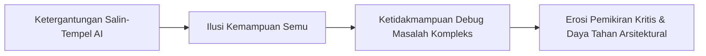

### Ilusi Produktivitas Instan

Di era *generative AI*, menghasilkan 50 baris kode atau konfigurasi Kubernetes hanya butuh waktu 5 detik. Salin perintah kesalahan (*error message*), tempel ke *chatbot*, dan salin balik solusinya ke editor kode.

Bagi banyak pengembang, ini terasa seperti lompatan produktivitas super.

Namun, tanpa disadari, terjadi erosi mental yang berbahaya: **kita mulai menyerahkan proses berpikir kritis (*outsource thinking*) kepada mesin**.

---

## Jebakan Kognitif: Perbedaan Antara Mengetahui dan Memahami

Ketika kita selalu meminta jawaban instan dari AI tanpa menelusuri logika di baliknya, kita terjerumus ke dalam dua jebakan besar:

### 1. Ilusi Pengetahuan (*Illusion of Competence*)
Model AI mampu memberikan jawaban salah dengan nada yang sangat meyakinkan (*confident hallucinations*). Tanpa pemahaman fundamental yang kuat, seorang *engineer* tidak akan mampu membedakan mana solusi elegan dan mana kode berbahaya yang memiliki celah keamanan fatal.

### 2. Melemahnya Otot Analisis Masalah
Keahlian *engineering* sejati tidak dibentuk saat kode berjalan lancar, melainkan saat kita bergelut membaca *stack trace*, menganalisis kegagalan jaringan, dan mencari akar masalah (*root cause*). Menghilangkan proses investigasi ini sama dengan melemahkan insting pemecahan masalah kita.

---

## Tiga Kaidah Emas: Menjadikan AI sebagai Mentor, Bukan Jalan Pintas

Gunakan AI untuk mempercepat kurva belajar, bukan untuk mematikan rasa ingin tahu intelektual Anda:

1. **Ubah Format Pertanyaan (*Concept-First Prompting*)**:
   - ❌ *"Buatkan skrip bash untuk membersihkan zombie process di Linux."*
   -  *"Jelaskan mengapa zombie process terbentuk di Linux, bagaimana kernel menanganinya, dan bagaimana strategi mitigasi terbaiknya?"*
2. **Kaidah Rekonstruksi Mandiri (*Active Reconstruction*)**:
   - Setelah membaca solusi yang disarankan AI, tutup jendela *chat*. Tulis ulang logika kode atau konfigurasi tersebut dari awal secara mandiri untuk memastikan Anda benar-benar paham.
3. **Posisikan Diri sebagai Kepala Arsitek (*Human-in-the-Loop*)**:
   - AI adalah asisten perumus draf (*drafting assistant*). Tanggung jawab atas kebenaran, efisiensi memori, dan keamanan sistem produksi tetap berada 100% di tangan Anda.

---

## Langkah Taktis yang Bisa Diterapkan

Agar ketajaman logika dan keahlian rekayasa Anda tetap terasah saat berkolaborasi dengan kecerdasan buatan, terapkan empat prinsip berikut:

1. **Gunakan Prompt Dekonstruksi Konsep (*Concept-First Prompting*)**: Alihkan kebiasaan meminta kode jadi instan menjadi permintaan penjelasan alur kerja dan analogi sistem (contoh: *"Jelaskan trade-off antara algoritma Raft dan Paxos"* alih-alih *"Buatkan kode konsensus"*).
2. **Ketik Ulang dan Rekonstruksi Solusi Secara Mandiri**: Tulis kembali potongan kode dari AI baris demi baris, ubah nama variabel, serta modifikasi strukturnya guna memastikan Anda memahami model mental di baliknya.
3. **Uji Skenario Kegagalan Ekstrem (*Stress-Test the Output*)**: Tantang kode buatan AI dengan kasus batas (*edge cases*), beban konkuren tinggi, dan skenario kesalahan jaringan untuk memverifikasi keamanannya.
4. **Pertahankan Kendali Arsitektur (*Human-Centric Ownership*)**: Posisikan AI hanya sebagai asisten riset awal atau pembuat draf; keputusan desain tingkat tinggi dan tanggung jawab stabilitas sistem tetap berada di tangan Anda.

> "Anda boleh mendelegasikan eksekusi teknis kepada mesin, tetapi jangan pernah menyerahkan pemahaman Anda. Saat sistem produksi tumbang, yang menyelesaikan krisis adalah model mental di kepala Anda, bukan AI."

---

### Diskusikan Pendekatan Belajar Anda

Bagaimana Anda memanfaatkan AI dalam alur kerja harian? Apakah lebih sering mendelegasikan tugas mekanis (*outsource thinking*) atau pernah terjebak menyerahkan pemahaman konsep (*outsource understanding*) ke mesin? Mari bagikan refleksi Anda di kolom komentar!

---

  
💡 Pojok Bahasa Inggris

  <ul class="text-sm space-y-1 text-text-secondary">
    <li><strong>Outsource Thinking</strong>: Mendelegasikan tugas mekanis atau repetitif ke mesin tanpa kehilangan kendali atas logika proses.</li>
    <li><strong>Mental Model</strong>: Representasi pemahaman konseptual di benak seorang engineer mengenai cara kerja internal suatu sistem.</li>
  </ul>

---

[← Kembali ke Daftar Artikel]({{ '/blog/' | relative_url }})
