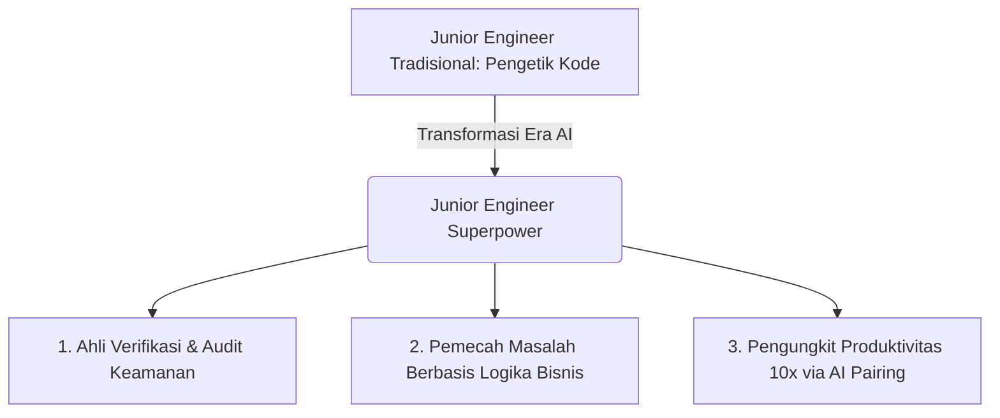

### Pergeseran Standar di Titik Masuk Industri Perangkat Lunak

Pasar kerja rekayasa perangkat lunak telah bertransformasi secara fundamental. Peran tradisional *junior developer* yang hanya bertugas menulis kode *boilerplate*, membuat dokumen manual, atau menghafal sintaks API kini semakin tergerus oleh kehadiran asisten kecerdasan buatan (*AI code assistants*).

Namun, ini bukanlah akhir bagi talenta baru.

Bagi mereka yang memahami cara memanfaatkan teknologi ini dengan benar, AI adalah **pengungkit karier (*career leverage*) tercepat yang pernah ada dalam sejarah rekayasa perangkat lunak**.

---

## Tiga Peran Baru Junior Engineer yang Bernilai Tinggi

Untuk unggul di pasar rekayasa modern, seorang *engineer* pemula harus bertransisi dari sekadar "penghafal kode" menjadi **perancang dan penguji sistem (*systems verifier*)**:

### 1. Verifikasi Aktif & Audit Keamanan (*Verification Specialist*)
Siapa pun bisa meminta AI membuat fungsi login. Tetapi insinyur yang bernilai tinggi adalah mereka yang tahu bagaimana menguji *edge cases*, memvalidasi kerentanan *SQL Injection* / *XSS*, dan memastikan token sesi diamankan menggunakan standar *HttpOnly* dan *SameSite*.

### 2. Memahami Arsitektur di Balik Kode (*Architectural Context*)
AI sering memberikan kode yang terisolasi tanpa memahami konteks lingkungan produksi. Nilai Anda terletak pada kemampuan menyambungkan modul tersebut ke *pipeline* CI/CD, mengonfigurasi *logging* ke Prometheus/Loki, dan memperhitungkan batasan latensi jaringan.

### 3. Eksekusi Cepat Melalui AI Pair Programming
Gunakan AI sebagai rekan diskusi yang siaga 24/7. Gunakan untuk merefaktor kode, membuat *unit test* komprehensif, dan mengeksplorasi dokumentasi teknologi baru dalam hitungan menit.

---

## Tiga Langkah Membangun Portofolio Berdaya Saing Tinggi

Jangan membuat portofolio aplikasi *To-Do List* generik yang bisa dibuat AI dalam 10 detik. Bangun reputasi profesional Anda dengan proyek yang membuktikan kemampuan pengambilan keputusan nyata:

1. **Dokumentasikan Pengambilan Keputusan (*Architecture Decision Records / ADR*)**: Tulis alasan mengapa Anda memilih basis data PostgreSQL dibanding DynamoDB, atau bagaimana Anda merancang mekanisme *retry* yang aman dari *thundering herd problem*.
2. **Tunjukkan Pengalaman Operasional & Observability**: Pasang monitoring metrik dan pelacakan error (*tracing*) pada aplikasi Anda. Buktikan bahwa Anda peduli terhadap performa sistem di lingkungan produksi.
3. **Pamerkan Kontribusi Open-Source**: Berkontribusilah pada ekosistem komunitas. Memperbaiki bug atau menyempurnakan dokumentasi proyek terbuka membuktikan kemampuan kolaborasi tim Anda.

---

## Rangkuman Aksi & Klimaks Filosofis

Kecerdasan buatan tidak akan menggantikan *junior engineer*. Namun, **junior engineer yang mahir memadukan intuisi rekayasa manusia dengan kecepatan AI akan menggantikan mereka yang menolak beradaptasi**.

**"Jangan habiskan energi Anda untuk menghafal hal-hal yang bisa dicari mesin dalam 2 detik. Alokasikan waktu Anda untuk mengasah kemampuan memvalidasi kebenaran, memahami arsitektur sistem, dan menyelesaikan masalah nyata bagi manusia."**

---

### Bagikan & Diskusikan
Bagaimana Anda memanfaatkan perkakas AI dalam proses pengembangan karier harian Anda?
- 📤 **Bagikan panduan ini** kepada sesama rekan pengembang dan komunitas tech Anda.
- 💻 Lihat contoh proyek arsitektural dan resume interaktif di [Terminal CV]({{ '/terminal/' | relative_url }}).
- 💬 Mari berdiskusi dan bertukar cerita di kolom komentar di bawah!

---

<strong>💡 Pojok Bahasa Inggris</strong> 
1. <strong>Leverage</strong>: <em>Daya ungkit</em> — kemampuan untuk melipatgandakan hasil kerja dengan memanfaatkan instrumen atau teknologi yang efisien. 
2. <strong>Boilerplate Code</strong>: <em>Kode templat / Kode standar</em> — potongan kode repetitif yang harus disertakan di banyak tempat dengan sedikit atau tanpa perubahan logika.

