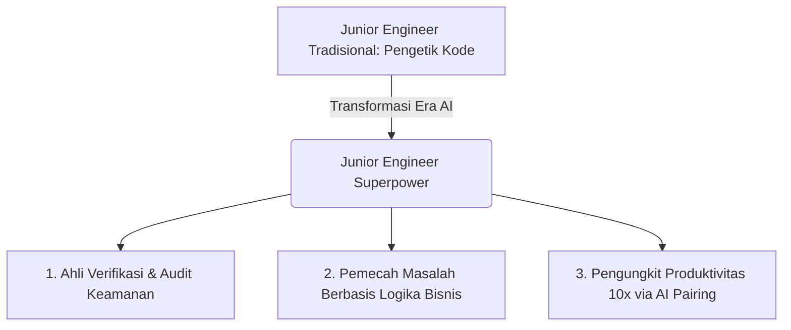

### Pergeseran Standar di Titik Masuk Industri Perangkat Lunak

Pasar kerja rekayasa perangkat lunak telah bertransformasi secara fundamental. Peran tradisional *junior developer* yang hanya bertugas menulis kode *boilerplate*, membuat dokumen manual, atau menghafal sintaks API kini semakin tergerus oleh kehadiran asisten kecerdasan buatan (*AI code assistants*).

Namun, ini bukanlah akhir bagi talenta baru.

Bagi mereka yang memahami cara memanfaatkan teknologi ini dengan benar, AI adalah **pengungkit karier (*career leverage*) tercepat yang pernah ada dalam sejarah rekayasa perangkat lunak**.

---

## Tiga Peran Baru Junior Engineer yang Bernilai Tinggi

Untuk unggul di pasar rekayasa modern, seorang *engineer* pemula harus bertransisi dari sekadar "penghafal kode" menjadi **perancang dan penguji sistem (*systems verifier*)**:

### 1. Verifikasi Aktif & Audit Keamanan (*Verification Specialist*)
Siapa pun bisa meminta AI membuat fungsi login. Tetapi insinyur yang bernilai tinggi adalah mereka yang tahu bagaimana menguji *edge cases*, memvalidasi kerentanan *SQL Injection* / *XSS*, dan memastikan token sesi diamankan menggunakan standar *HttpOnly* dan *SameSite*.

### 2. Memahami Arsitektur di Balik Kode (*Architectural Context*)
AI sering memberikan kode yang terisolasi tanpa memahami konteks lingkungan produksi. Nilai Anda terletak pada kemampuan menyambungkan modul tersebut ke *pipeline* CI/CD, mengonfigurasi *logging* ke Prometheus/Loki, dan memperhitungkan batasan latensi jaringan.

### 3. Eksekusi Cepat Melalui AI Pair Programming
Gunakan AI sebagai rekan diskusi yang siaga 24/7. Gunakan untuk merefaktor kode, membuat *unit test* komprehensif, dan mengeksplorasi dokumentasi teknologi baru dalam hitungan menit.

---

## Tiga Langkah Membangun Portofolio Berdaya Saing Tinggi

Jangan membuat portofolio aplikasi *To-Do List* generik yang bisa dibuat AI dalam 10 detik. Bangun reputasi profesional Anda dengan proyek yang membuktikan kemampuan pengambilan keputusan nyata:

1. **Dokumentasikan Pengambilan Keputusan (*Architecture Decision Records / ADR*)**: Tulis alasan mengapa Anda memilih basis data PostgreSQL dibanding DynamoDB, atau bagaimana Anda merancang mekanisme *retry* yang aman dari *thundering herd problem*.
2. **Tunjukkan Pengalaman Operasional & Observability**: Pasang monitoring metrik dan pelacakan error (*tracing*) pada aplikasi Anda. Buktikan bahwa Anda peduli terhadap performa sistem di lingkungan produksi.
3. **Pamerkan Kontribusi Open-Source**: Berkontribusilah pada ekosistem komunitas. Memperbaiki bug atau menyempurnakan dokumentasi proyek terbuka membuktikan kemampuan kolaborasi tim Anda.

---

## Langkah Taktis yang Bisa Diterapkan

Untuk mengubah AI menjadi *superpower* karir rekayasa perangkat lunak Anda, lakukan empat langkah taktis berikut:

1. **Percepat Triage Akar Masalah (*Root Cause Triage*)**: Gunakan AI untuk membedah *stack trace* dan pesan error yang rumit dalam hitungan detik, lalu telusuri dokumentasi resmi untuk memahami alasan teknis terjadinya galat tersebut.
2. **Praktikkan Pemrograman Berpasangan (*AI Pair Programming*)**: Manfaatkan AI untuk menghasilkan rancangan pengujian (*test cases*) dan variasi skenario kegagalan, lalu tulis logika kode inti secara disiplin dan terstruktur.
3. **Alihkan Waktu Belajar ke Desain Sistem (*System Architecture Focus*)**: Manfaatkan efisiensi waktu dari penulisan kode *boilerplate* untuk mendalami topik berbobot tinggi seperti arsitektur sistem terdistribusi, optimasi basis data, dan jaringan.
4. **Bangun Portofolio Berbasis Keputusan Rekayasa**: Tunjukkan dalam proyek portofolio Anda bagaimana Anda mengevaluasi trade-off arsitektur, menangani kegagalan sistem, dan memvalidasi keamanan kode yang dihasilkan oleh AI.

> "AI tidak akan menggantikan insinyur perangkat lunak; AI hanya akan menggantikan mereka yang berhenti berpikir dan sekadar menjadi pengetik sintaks."

---

  
💡 Pojok Bahasa Inggris

  <ul class="text-sm space-y-1 text-text-secondary">
    <li><strong>Pair Programming</strong>: Praktik rekayasa perangkat lunak di mana dua pihak berkolaborasi bersama pada satu basis kode secara aktif.</li>
    <li><strong>Stack Trace</strong>: Laporan jejak eksekusi fungsi dan alur panggilan program sesaat sebelum terjadinya error pada sistem.</li>
  </ul>

---

## Referensi

1. [**Be Global / ByteIota**](https://byteiota.com/developer-hiring-crisis-2026-40-worse-junior-drops-73/) - *Developer Hiring Crisis 2026: 40% Worse, Junior Drops 73%* (Statistik penurunan lowongan kerja dan tingkat pengangguran teknik komputer).
2. [**World Economic Forum**](https://www.weforum.org/agenda/2026/08/as-ai-reshapes-entry-level-software-jobs-where-will-senior-developers-come-from/) - *As AI reshapes entry-level software jobs, where will senior developers come from?* (Analisis tantangan erosi jalur magang tradisional akibat otomatisasi tugas dasar).
3. [**PwC**](https://www.pwc.com/us/en/tech-effect/ai-analytics/generative-ai-for-software-development.html) - *10 ways GenAI improves software development* (Tren transisi peran pengembang menuju AI-augmented system designers).

---

[← Kembali ke Daftar Artikel]({{ '/blog/' | relative_url }})
