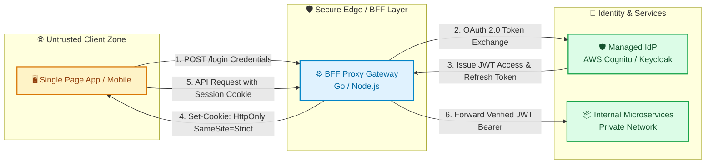

Autentikasi dan Single Sign-On (SSO) merupakan komponen infrastruktur krusial yang berdampak langsung pada ketersediaan sistem (availability) dan postur keamanan organisasi. Kegagalan pada sistem autentikasi bertindak sebagai titik kegagalan tunggal (single point of failure) yang dapat melumpuhkan seluruh layanan mikro, sekaligus menjadi target utama serangan kebocoran kredensial dan eksploitasi token.

Buku panduan (handbook) ini disusun khusus untuk **Site Reliability Engineering (SRE), DevOps, dan Security Engineers**. Fokus pembahasan meliputi perbandingan pola deployment, analisis kerentanan sistemik infrastruktur autentikasi internal, arsitektur backend-for-frontend (BFF) proxy, panduan penanganan insiden produksi (incident runbook), serta strategi migrasi basis data identitas tanpa downtime.

---

## 📑 Daftar Isi (Table of Contents)
1. [Chapter 1: Analisis Pola Deployment & Overhead Operasional](#chapter-1-analisis-pola-deployment--overhead-operasional)
2. [Chapter 2: Risiko Sistemik & Ancaman Keamanan Autentikasi Internal](#chapter-2-risiko-sistemik--ancaman-keamanan-autentikasi-internal)
3. [Chapter 3: Desain Arsitektur: Headless Identity via BFF Proxy](#chapter-3-desain-arsitektur-headless-identity-via-bff-proxy)
4. [Chapter 4: SRE Runbook: Kegagalan Produksi & Mitigasi Kritis](#chapter-4-sre-runbook-kegagalan-produksi--mitigasi-kritis)
5. [Chapter 5: Migration Playbook: Just-In-Time User Migration](#chapter-5-migration-playbook-just-in-time-user-migration)
6. [Chapter 6: Matriks Infrastruktur & Kepatuhan](#chapter-6-matriks-infrastruktur--kepatuhan)

---

## Chapter 1: Analisis Pola Deployment & Overhead Operasional

Tabel berikut membandingkan karakteristik operasional dari tiga pendekatan infrastruktur autentikasi utama:

| Pola Deployment | SLA & Ketersediaan | Overhead Operasional SRE | Performa & Latensi |
| :--- | :--- | :--- | :--- |
| **Managed Cloud IdP** (Cognito, Auth0) | Sangat Tinggi (Dikelola penuh oleh penyedia cloud) | Rendah. Hanya fokus pada konfigurasi dan batas kuota rate limit. | Tergantung pada koneksi jaringan eksternal. Butuh caching token di layer BFF. |
| **Self-Hosted Open Source IdP** (Keycloak, Zitadel) | Menengah. SRE mengelola replikasi DB dan HPA Kubernetes. | Tinggi. Memerlukan patching berkala, tuning JVM/Go runtime, dan monitoring DB. | Sangat cepat karena berada di jaringan internal cluster yang sama. |
| **Custom In-House Auth** (Bcrypt + DB lokal) | Rendah. Rentan terhadap kegagalan beruntun (cascading failure). | Sangat Tinggi. SRE harus mengelola optimasi CPU hashing dan token revocation list secara manual. | Cepat pada kondisi beban normal. Degradasi performa drastis saat terjadi serangan CPU exhaustion. |

Pilihan pendekatan berdampak langsung pada beban kerja on-call. SRE dan Security Engineers harus memprioritaskan pengurangan kompleksitas operasional pada komponen non-bisnis agar dapat mengalokasikan sumber daya pada keandalan infrastruktur inti.

---

## Chapter 2: Risiko Sistemik & Ancaman Keamanan Autentikasi Internal

Membangun infrastruktur autentikasi internal dari nol memicu beberapa titik kegagalan infrastruktur dan celah keamanan (vulnerability):

*   **Bcrypt CPU Exhaustion (Denial of Service)**: Penggunaan algoritma hashing seperti Bcrypt dengan *cost factor* tinggi memakan resource CPU secara intensif. Serangan brute force massal dapat dengan cepat melumpuhkan resource CPU di node Kubernetes, bertindak sebagai vektor Denial of Service (DoS) yang efektif.
*   **Token Revocation Latency**: Menyimpan token yang dicabut (revoked tokens) dalam basis data utama memicu overload pada database read query. SRE sering terpaksa mengimplementasikan lapisan Redis tambahan untuk caching token blacklist.
*   **Database Coupling**: Penggabungan tabel user id dengan tabel transaksi bisnis membuat proses migrasi skema database menjadi sangat kaku dan berisiko tinggi secara operasional.
*   **JWKS Key Rotation Complexity (Cryptographic Flaws)**: Banyak sistem internal gagal mengimplementasikan rotasi kunci asimetris otomatis untuk validasi JWT. Hal ini berujung pada potensi downtime saat kunci enkripsi kedaluwarsa atau risiko pemalsuan token (token forgery) jika kunci yang bocor tidak dapat dicabut secara instan.
*   **Vektor Credential Stuffing**: Ketiadaan mekanisme mitigasi deteksi anomali login terdistribusi membuat autentikasi kustom rentan terhadap botnet pengambilalihan akun (account takeover), meningkatkan risiko pelanggaran data (data breach).
*   **OWASP Broken Authentication**: Sistem internal rentan terhadap celah verifikasi token seperti tidak memeriksa algoritma hashing JWT (Key Confusion Attack) atau membiarkan masa berlaku token (expiry time) terlalu lama tanpa rotasi berkala.

---

## Chapter 3: Desain Arsitektur: Headless Identity via BFF Proxy

Untuk menjaga performa dan keamanan token, gunakan pola arsitektur **Backend-for-Frontend (BFF)**:

  <!-- Frontend Layer -->
  

    

      🖥️ Client-Side Browser
      Hanya menyimpan Secure HttpOnly Cookies
    

  

  
  <!-- Flow 1 -->
  

    │ &nbsp; POST /auth/login (Session Cookie)
     ▼
  

  <!-- BFF Layer -->
  

    

      ⚙️ BFF Gateway (Go / Node.js)
      Validasi Token &amp; Enkripsi Sesi
    

  

  <!-- Flow 2 -->
  

    │ &nbsp; Direct OAuth / API Call
     ▼
  

  <!-- Managed IdP Layer -->
  

    

      🛡️ Identity Provider (Cognito / Keycloak)
      User Directory &amp; Crypto Signing Engine
    

  

### Standar Implementasi Keamanan:
1.  **IETF RFC 9700 (OAuth 2.0 for Browser-Based Apps)**: Browser dikategorikan sebagai lingkungan tidak aman. Gunakan BFF Proxy untuk menukar otorisasi menjadi cookie sesi terenkripsi. Hindari penyimpanan token JWT mentah di JavaScript client-side (seperti localStorage).
2.  **Atribut Cookie Sesi**: Setel cookie sesi dengan parameter `HttpOnly`, `Secure`, dan `SameSite=Strict` untuk memitigasi serangan Cross-Site Scripting (XSS) dan Cross-Site Request Forgery (CSRF).

---

## Chapter 4: SRE Runbook: Kegagalan Produksi & Mitigasi Kritis

Gunakan panduan berikut untuk menangani insiden sistem autentikasi di produksi:

| Gejala Insiden | Dampak Sistem | Langkah Mitigasi SRE |
| :--- | :--- | :--- |
| **Bcrypt CPU Exhaustion** (Serangan Brute Force) | CPU Pod Kubernetes 100%, terjadi restating pod berulang akibat kegagalan liveness probe. | 1. Terapkan rate limiting ketat pada IP penyerang di level WAF. 2. Setel batas panjang karakter password input (maksimal 128 karakter) pada BFF. |
| **Token Revocation Storm** (Blacklist lookup latency) | Latensi Redis melonjak tinggi, memicu kegagalan beruntun pada API Gateway. | 1. Gunakan durasi token yang pendek (short-lived access tokens, 5-15 menit). 2. Implementasikan local cache berdurasi singkat di sisi gateway. |
| **TOTP MFA Time-Drift** (Desinkronisasi waktu) | Pengguna sah gagal login akibat kegagalan validasi kode OTP. | 1. Aktifkan fitur sinkronisasi waktu NTP otomatis pada host mesin. 2. Berikan toleransi clock drift ±1 time-step (RFC 6238 window = 90 detik). |
| **JWKS Signature Failure** (Kegagalan rotasi kunci) | Validasi JWT gagal total di seluruh microservices. | 1. Validasi cache JWKS dan paksa refresh JWKS endpoint dari IdP. 2. Pastikan outbound connectivity ke URL JWKS dari cluster dalam kondisi normal. |

---

## Chapter 5: Migration Playbook: Just-In-Time User Migration

Untuk memigrasikan data pengguna dari basis data monolit lama ke Managed IdP tanpa downtime, gunakan pola **Strangler Fig dengan Just-In-Time (JIT) Migration**:

  <!-- Start -->
  

    User Mengirim Request Login
    
▼

  

  <!-- Step 1 Box -->
  

    
Cek Status User di Managed IdP

    

      ➔ ADA: Validasi password di IdP. Selesai.
      ➔ TIDAK ADA: Lanjut verifikasi ke Database Lama.
    

  

  
▼ (Legacy Path)

  <!-- Step 2 Box -->
  

    
Verifikasi Hash di Database Lama

    

      
✖ PASSWORD SALAH: Kembalikan respons 401.

      
✔ PASSWORD BENAR: Jalankan Migrasi Otomatis JIT:

      <ul style="color: var(--on-surface-variant, #6b6b6b); margin: 0.4rem 0 0 1.2rem; line-height: 1.4;">
        <li>Daftarkan user dan password ke Managed IdP menggunakan API admin.</li>
        <li>Setel flag lokal migrated = true pada database lama.</li>
        <li>Keluarkan token sesi dan izinkan pengguna masuk.</li>
      </ul>
    

  

### Alur Eksekusi Migrasi:
1.  **Fase 1 (Dual Verification)**: Gateway memeriksa IdP terlebih dahulu. Jika pengguna belum terdaftar di IdP, sistem memvalidasi password menggunakan hash pada database lama.
2.  **Fase 2 (Just-In-Time Import)**: Jika password valid pada database lama, daftarkan pengguna tersebut secara otomatis ke IdP baru menggunakan password teks asli yang diinput saat login. SRE tidak perlu menyimpan password teks asli secara permanen pada basis data.
3.  **Fase 3 (Clean Up)**: Setelah masa transisi (misalnya 90 hari), matikan alur verifikasi database lama. Pengguna yang belum login selama periode tersebut dapat diarahkan untuk menggunakan alur *Reset Password* pada IdP baru.

---

## Chapter 6: Matriks Keputusan Arsitektur & Kepatuhan

Gunakan panduan berikut untuk menentukan opsi deployment autentikasi yang sesuai dengan kebutuhan ketersediaan sistem dan standar kepatuhan (*compliance*):

| Kebutuhan Infrastruktur & Kepatuhan | Opsi Rekomendasi | Arsitektur & Keamanan |
| :--- | :--- | :--- |
| Skalabilitas elastis, zero maintenance server, kepatuhan instan (SOC 2, ISO 27001). | **Managed Cloud IdP** (AWS Cognito / Auth0) | Integrasikan menggunakan pola BFF untuk mengamankan pertukaran token di backend. |
| Regulasi kedaulatan data finansial ketat / jaringan tertutup (*air-gapped network*). | **Self-Hosted Open-Source IdP** (Keycloak / Zitadel) | Deploy di Kubernetes privat dengan enkripsi penyimpanan dan backup terotomatisasi. |
| Membangun server autentikasi sendiri dari nol (*In-House Auth Engine*). | **Sangat Tidak Direkomendasikan** | Memperbesar liabilitas keamanan (*OWASP vulnerabilities*) dan menyedot kapasitas tim. |

---

## Langkah Taktis yang Bisa Diterapkan

Untuk mengamankan dan memodernisasi infrastruktur autentikasi tanpa membebani keandalan operasional, lakukan empat langkah taktis berikut:

1. **Terapkan Pola Backend-for-Frontend (BFF Proxy)**: Jauhkan token JWT mentah dari JavaScript peramban (*browser local storage*) dan enkripsi sesi autentikasi ke dalam *Secure, HttpOnly, SameSite=Strict* cookies pada gateway.
2. **Gunakan Penyedia Identitas Terkelola (*Managed / Standard IdP*)**: Hindari membangun mekanisme enkripsi dan manajemen pengguna sendiri dari nol (*in-house auth*) demi mencegah risiko kelemahan kriptografi, celah OWASP, dan lonjakan CPU akibat kalkulasi *hashing*.
3. **Eksekusi Migrasi Bertahap Tepat Waktu (*Just-In-Time Migration*)**: Terapkan arsitektur *Strangler Fig* dengan validasi ganda untuk memindahkan data pengguna secara transparan saat login tanpa memicu *downtime* sistem.
4. **Otomatisasi Validasi JWKS dan Mitigasi Token Storm**: Pasang *caching* lokal berdurasi singkat untuk kunci asimetris JWKS dan tetapkan masa berlaku *access token* pendek (5–15 menit) guna membatasi dampak kebocoran kredensial.

> "Infrastruktur identitas adalah benteng terdepan keamanan dan ketersediaan sistem. Mengembangkan auth kustom demi menghemat biaya lisensi adalah ilusi yang dibayar mahal dengan downtime dan liabilitas keamanan."

---

### Diskusikan Arsitektur Identitas Anda

Bagaimana tim Anda mengelola token sesi dan autentikasi pengguna saat ini? Apakah sudah beralih ke pola BFF dan Managed IdP, atau masih mengelola basis data autentikasi monolit internal? Mari berbagi pengalaman di kolom komentar!

---

  
💡 Pojok Bahasa Inggris

  <ul class="text-sm space-y-1 text-text-secondary">
    <li><strong>Backend-for-Frontend (BFF)</strong>: Pola arsitektur perantara backend yang bertugas menangani logika presentasi, agregasi API, dan pertukaran token secara aman bagi antarmuka klien.</li>
    <li><strong>Just-In-Time (JIT) Migration</strong>: Metode migrasi data pengguna yang terjadi secara otomatis dan transparan saat pengguna melakukan autentikasi aktif.</li>
  </ul>

---

## Referensi & Bacaan Lanjutan
*   [IETF RFC 9700: OAuth 2.0 for Browser-Based Applications](https://datatracker.ietf.org/doc/html/draft-ietf-oauth-browser-based-apps)
*   [OWASP Token Storage and Session Management Cheat Sheet](https://cheatsheetseries.owasp.org/cheatsheets/Authentication_Cheat_Sheet.html)
*   [AWS Cognito Developer Guide: Direct Authentication API](https://docs.aws.amazon.com/cognito/latest/developerguide/amazon-cognito-user-pools-authentication-flow.html)
*   [Keycloak Deployment and Scaling Guide](https://www.keycloak.org/guides)
*   [Netflix Technology Blog: Evolution of Edge Identity & Passports](https://netflixtechblog.com/)

---

[← Kembali ke Daftar Artikel]({{ '/blog/' | relative_url }})
