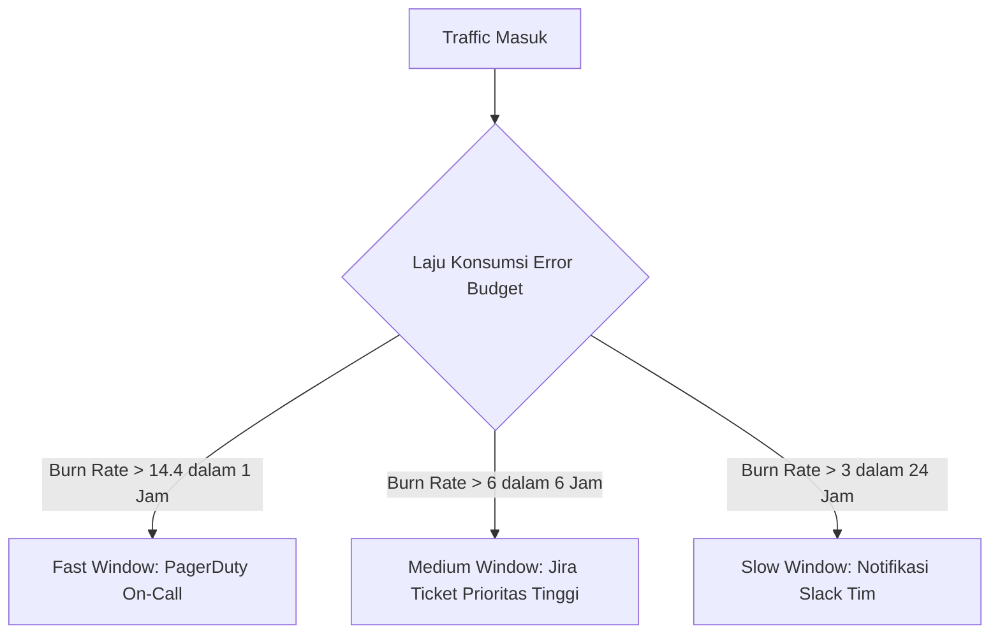

> ### 🎯 Ringkasan Utama (Key Takeaways)
> 
> 1. **Error budget adalah kuota kegagalan** yang disepakati bersama antara tim pengembang produk dan tim SRE untuk menyeimbangkan inovasi serta reliabilitas.
> 2. **Perhitungan rolling window 30 hari** lebih adil dan akurat dibanding bulan kalender karena tidak memiliki bias reset tanggal satu.
> 3. **Multi-window multi-burn-rate alerting** memisahkan alarm darurat untuk *pager* malam hari dari tiket investigasi berkala.
> 4. **Consequence engine** memberikan kepastian hukum operasional ketika kuota keandalan habis.

---

### Menolak Ilusi Uptime 100%

Mengejar tingkat ketersediaan layanan (*uptime*) sebesar 100% adalah target yang keliru dan membuang biaya infrastruktur secara sia-sia. Pengguna tidak dapat membedakan ketersediaan 99.99% dengan 100% jika jaringan seluler mereka sendiri memiliki tingkat kegagalan lebih tinggi.

*Site Reliability Engineering* (SRE) memandang kegagalan sebagai konsekuensi wajar dari sistem terdistribusi yang terus berkembang. Melalui *Service Level Objective* (SLO), tim teknik mendefinisikan batas keandalan minimum yang dapat diterima pengguna. Selisih dari target tersebut adalah **error budget** (anggaran toleransi kegagalan).

<figure>
  
  <figcaption>Alur implementasi Error Budget di produksi: dari penentuan SLO, perhitungan kuota, strategi alarm burn-rate, hingga integrasi Prometheus dan Grafana.</figcaption>
</figure>

---

## 1. Menghitung SLO dan Error Budget Berbasis Rolling Window

Dasar perhitungan *error budget* bertumpu pada rumus sederhana:

```
Error Budget = Total Waktu × (1 - SLO)
```

Jika layanan menetapkan target SLO ketersediaan sebesar **99.5%** dalam kurun waktu 30 hari:

* **Total waktu per bulan**: 30 hari × 24 jam = 720 jam (43.200 menit).
* **Jatah toleransi kegagalan (*allowed downtime*)**: 720 jam × (1 - 0.995) = 3.6 jam atau setara dengan **3 jam 39 menit**.
* **Rata-rata toleransi harian**: toleransi eror sekitar **7.2 menit per hari**.

| Target SLO | Toleransi Downtime per Bulan (30 Hari) | Toleransi Downtime per Hari | Kompleksitas Arsitektur |
| :--- | :--- | :--- | :--- |
| **99.0%** | 7 jam 12 menit | 14.4 menit | Tunggal instance, backup berkala |
| **99.5%** | **3 jam 39 menit** | **7.2 menit** | Multi-AZ, auto-recovery standar |
| **99.9%** | 43 menit 12 detik | 1.4 menit | Multi-AZ aktif-aktif, automated failover |
| **99.99%** | 4 menit 19 detik | 8.6 detik | Multi-region, zero-downtime deployments |

### Keunggulan 30-Day Rolling Window

Banyak organisasi melakukan kesalahan dengan menghitung SLO berdasarkan bulan kalender (*calendar month*). Pendekatan ini memiliki kelemahan fatal: jika insiden besar terjadi pada tanggal 2, tim harus hidup dalam kecemasan selama 28 hari berikutnya. Sebaliknya, jika insiden terjadi pada tanggal 30, kuota otomatis di-reset pada tanggal 1 seolah tidak pernah terjadi masalah.

Menggunakan **rolling window 30 hari** (jendela waktu bergulir) memastikan performa sistem dinilai secara konsisten berdasarkan 720 jam terakhir tanpa terpengaruh pergantian tanggal kalender.

---

## 2. Multi-Window Multi-Burn-Rate Alerting

Mengirimkan alarm saat satu *request* gagal akan menimbulkan *alert fatigue* (kelelahan akibat alarm palsu). Sebaliknya, menunggu hingga 3 jam *downtime* terakumulasi akan membuat respons terlambat.

Solusinya adalah mengukur **burn rate** (laju kecepatan konsumsi kuota). *Burn rate* bernilai 1 berarti seluruh *error budget* akan habis tepat dalam 30 hari. *Burn rate* bernilai 14.4 berarti 2% kuota bulanan terbakar hanya dalam kurun waktu 1 jam.



### Matriks Aksi Penanganan Insiden

| Burn Rate | Jendela Waktu (Window) | Persentase Budget Terbakar | Tingkat Keparahan | Aksi Operasional |
| :--- | :--- | :--- | :--- | :--- |
| **> 14.4** | 1 jam (*Fast*) | 2% dalam 1 jam | `severity: critical` | Pager on-call langsung berdering (eskalasi instan) |
| **> 6.0** | 6 jam (*Medium*) | 5% dalam 6 jam | `severity: warning` | Pembuatan tiket Jira otomatis untuk investigasi hari kerja |
| **> 3.0** | 24 jam (*Slow*) | 10% dalam 1 hari | `severity: info` | Notifikasi saluran Slack tim untuk evaluasi sprint |

Pemisahan ini memastikan insiden kritis tertangani cepat tanpa mengganggu waktu istirahat tim untuk degradasi performa kecil yang tidak mendesak.

---

## 3. Implementasi Tooling: Prometheus, Alertmanager, dan Grafana

Untuk menjalankan arsitektur ini secara efisien, kita memanfaatkan rantai perkakas *observability* (keteramatan sistem) standar industri.

### Optimasi Metrik dengan Prometheus Recording Rules

Menghitung SLI (*Service Level Indicator*) secara *real-time* untuk rentang 30 hari membebani mesin database Prometheus (*Time Series Database / TSDB*). Kita menggunakan **recording rules** (aturan pra-hitung metrik) untuk menyimpan agregasi data secara berkala:

```yaml
# /etc/prometheus/rules/slo_recording_rules.yml
groups:
  - name: slo_recording_rules
    interval: 30s
    rules:
      # 1. Total request 5xx per 5 menit
      - record: sli:http_errors_total:rate5m
        expr: sum(rate(http_requests_total{status=~"5.."}[5m]))

      # 2. Total request keseluruhan per 5 menit
      - record: sli:http_requests_total:rate5m
        expr: sum(rate(http_requests_total[5m]))

      # 3. Kalkulasi burn rate instan (SLO 99.5%)
      - record: sli:error_budget_burn_rate:rate5m
        expr: >
          (sli:http_errors_total:rate5m / sli:http_requests_total:rate5m) 
          / (1 - 0.995)
```

### Konfigurasi Routing Alertmanager

Alertmanager mengarahkan notifikasi ke kanal yang tepat sesuai tingkat keparahan yang didefinisikan pada label metrik:

```yaml
# /etc/alertmanager/alertmanager.yml
route:
  group_by: ['alertname', 'service']
  group_wait: 30s
  group_interval: 5m
  repeat_interval: 4h
  receiver: 'slack-notifications'
  routes:
    - match:
        severity: critical
      receiver: 'pagerduty-oncall'
      repeat_interval: 15m
    - match:
        severity: warning
      receiver: 'jira-automation'
      repeat_interval: 2h

receivers:
  - name: 'pagerduty-oncall'
    pagerduty_configs:
      - service_key: '<PAGERDUTY_INTEGRATION_KEY>'
        severity: 'critical'

  - name: 'jira-automation'
    webhook_configs:
      - url: 'https://jira-webhook.internal/api/v1/issues'

  - name: 'slack-notifications'
    slack_configs:
      - channel: '#sre-alerts'
        send_resolved: true
```

### Visualisasi Panel Tunggal di Grafana

Di Grafana, buat panel *gauge bar* tunggal yang menampilkan sisa persentase *error budget* 30 hari terakhir. Panel ini menjadi rujukan tunggal (*single source of truth*) yang dipahami bersama oleh *engineer*, manajer produk, dan pimpinan bisnis.

Pendekatan ini sejalan dengan upaya kita dalam [Mengatasi Overload Tooling dalam DevOps Modern]({{ '/2026/08/16/overload-tooling-devops-modern/' | relative_url }}): menyajikan informasi esensial tanpa membanjiri tim dengan puluhan grafik metrik mentah.

---

## 4. Tata Kelola Error Budget (Consequence Engine)

*Error budget* tidak akan berfungsi tanpa adanya kesepakatan tegas mengenai konsekuensi saat kuota menipis. Kita menerapkan **Consequence Engine** (mesin penegak konsekuensi) sebagai aturan main bersama:

| Sisa Error Budget | Status Operasional | Protokol Tindakan |
| :--- | :--- | :--- |
| **> 50%** | *Normal Operation* | Rilis fitur baru berjalan sesuai jadwal sprint reguler. |
| **30% - 50%** | *Elevated Caution* | Rilis fitur diperketat; canary deployment diperpanjang durasinya. |
| **10% - 30%** | *Deployment Freeze* | Pembekuan rilis fitur non-esensial; hanya perbaikan bug kritis yang diizinkan lewat persetujuan SRE Lead. |
| **< 10%** | *Emergency Reliability Mode* | Seluruh kapasitas rekayasa dialihkan untuk stabilitas sistem dan perbaikan performa. |
| **0% (Exhausted)** | *Mandatory Post-Mortem* | Pembekuan total hingga akar masalah tuntas dan proses evaluasi RCA (*Root Cause Analysis*) selesai. |

Dengan aturan tertulis ini, perdebatan abadi antara tim pengembang yang ingin merilis fitur cepat dan tim operasional yang menjaga keandalan sistem dapat diselesaikan secara objektif berdasarkan data metrik terukur.

---

## Rangkuman Aksi & Klimaks Filosofis

Keandalan 100% adalah target yang salah dalam rekayasa perangkat lunak modern. Menuntut sistem tanpa ada kesalahan sama sekali hanya akan membekukan inovasi dan melipatgandakan biaya infrastruktur secara eksponensial.

*Error budget* memberi organisasi Anda kebebasan untuk mengambil risiko inovasi yang terukur.

**"Error budget bukanlah lisensi untuk menulis kode ceroboh; ia adalah instrumen pengukur keberanian berinovasi secara terkendali. Belanjakan budget keandalan Anda untuk merilis fitur bernilai tinggi, dan rem laju rilis seketika saat stabilitas pengguna terancam."**

---

### Bagikan & Diskusikan
Bagaimana cara tim Anda menegakkan konsekuensi saat SLO layanan terancam?
- 📤 **Bagikan panduan SLO ini** kepada tim SRE, DevOps, dan Product Manager Anda.
- ⚡ Pelajari cara menyederhanakan perkakas pemantauan di [Mengatasi Overload Tooling dalam DevOps Modern]({{ '/2026/08/16/overload-tooling-devops-modern/' | relative_url }}).
- 💬 Diskusikan arsitektur *alerting* dan metrik Prometheus Anda di kolom komentar di bawah!

---

<div style="background-color: #1E293B; color: #F8FAFC; padding: 12px; border-radius: 8px; border-left: 4px solid #38BDF8;">
<strong>💡 Pojok Bahasa Inggris</strong><br>
1. <strong>Burn Rate</strong>: <em>Laju pembakaran kuota</em> — kecepatan konsumsi kuota toleransi kegagalan (error budget) dalam satuan waktu relatif terhadap target SLO.<br>
2. <strong>Consequence Engine</strong>: <em>Penegak konsekuensi operasional</em> — kesepakatan tata kelola kebijakan rilis yang otomatis diberlakukan saat kuota error budget menipis.
</div>
