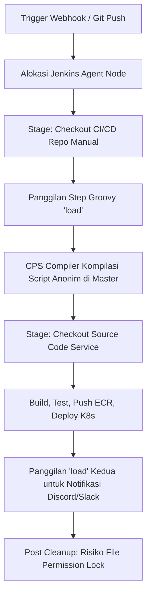
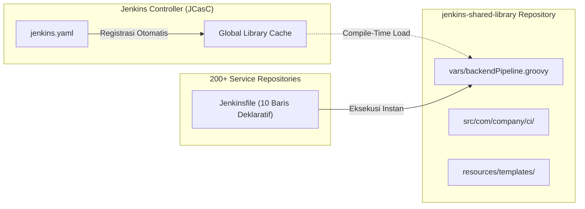

Bayangkan tim rekayasa perangkat lunak Anda mengelola lebih dari 200 repositori *microservices*. Setiap kali ada pembaruan standar keamanan atau perbaikan parameter lingkungan di sistem CI/CD, tim Platform Engineering atau SRE harus memodifikasi 200 berkas pipeline satu per satu secara manual.

Lebih menguras waktu lagi: setiap eksekusi *build* menghabiskan 15 hingga 30 detik ekstra hanya untuk melakukan *checkout* repositori konfigurasi yang sama dua kali, sementara konsumsi memori pada *Jenkins Master* perlahan membengkak tanpa alasan yang transparan.

Jika tim Anda mendistribusikan logika pipeline antar-layanan menggunakan perintah Groovy `load`, Anda sedang terjebak dalam pola arsitektur **Pseudo-Shared Library** (*Pustaka Bersama Semu*).

> ### 🎯 Ringkasan Utama (Key Takeaways)
> 
> 1. **Groovy `load` bukan Shared Library**: Mengevaluasi skrip pada saat *runtime* di *agent workspace* menciptakan dependensi ganda dan melewati validasi kompilasi di level *controller*.
> 2. **Dampak laten pada performa dan stabilitas Master**: Pemuatan skrip anonim berulang memicu pembuatan *dynamic class loader* di memori *Metaspace* JVM, meningkatkan risiko latensi *Garbage Collection* hingga kegagalan *Out Of Memory* (OOM).
> 3. **Redundansi Git I/O dan izin akses Docker**: Pola kloning repositori pustaka ke dalam direktori kerja *build* memicu *double checkout bug* dan memicu konflik izin berkas (*permission lock*) saat kontainer dijalankan dengan pengguna *root*.
> 4. **Modernisasi deklaratif via JCasC**: Mengintegrasikan *Jenkins Configuration as Code* dengan *Native Shared Library* (`vars/`, `src/`) memangkas 100+ baris *boilerplate* di setiap repositori menjadi deklarasi satu fungsi yang ringkas dan terstandarisasi.

<figure>
  
  <figcaption>Perbandingan arsitektur: Anti-Pattern Pseudo-Shared Library via Groovy load (kiri) yang memicu kebocoran memori vs Native Jenkins Shared Library berbasis JCasC (kanan) yang modular dan terkompilasi aman.</figcaption>
</figure>

---

## 1. Anatomi Masalah: Jebakan Groovy `load` Step

Inisiatif standarisasi alur kerja CI/CD umumnya bermula dari niat baik: menerapkan prinsip DRY (*Don't Repeat Yourself* / Jangan Mengulang Kode). Ketika sebuah organisasi berkembang pesat dari puluhan menjadi ratusan layanan mikro, duplikasi skrip *build*, *test*, dan *deploy* di setiap repositori menjadi momok operasional.

Namun, tanpa konfigurasi pustaka terpusat di tingkat *Jenkins Controller*, jalan pintas yang sering dipilih adalah menyimpan berkas skrip Groovy di repositori sentral, lalu mengunduh dan memuatnya secara dinamis menggunakan langkah `load`:

```groovy
// ❌ Anti-Pattern: Pseudo-Shared Library via Runtime load
pipeline {
  agent { node { label 'backend-agent' } }
  stages {
    stage('Checkout CI/CD Repo') {
      steps {
        dir('cicd-core') {
          checkout([$class: 'GitSCM', ...]) // Checkout manual repositori skrip
        }
      }
    }
    stage('Execute Modular Pipeline') {
      steps {
        script {
          // Evaluasi skrip dinamis saat runtime
          def modulePath = "${env.WORKSPACE}/cicd-core/modules/backend-pipeline.groovy"
          def module = load modulePath
          module.runBackendPipeline(config)
        }
      }
    }
  }
}
```



Meskipun terlihat berhasil pada skala kecil, pendekatan ini melahirkan empat cacat struktural yang merusak keandalan sistem orkestrasi:

### A. Double Checkout Bug dan Redundansi Git I/O
Agar langkah `load` dapat membaca berkas modul, *agent node* harus terlebih dahulu mengklon repositori CI/CD ke dalam *workspace*. Sering kali, di dalam logika modul itu sendiri, terdapat blok *checkout* lanjutan untuk mengambil dependensi atau manifes infrastruktur. 

Hasilnya adalah redundansi I/O jaringan, pemborosan kuota *rate limit* API GitHub/GitLab, serta penambahan durasi *build* sebesar 15 hingga 30 detik pada setiap eksekusi.

### B. Tekanan Memori Metaspace pada Jenkins Master
Step `load` mengevaluasi kode Groovy di lingkungan *runtime* agen. Namun, mesin CPS (*Continuation Passing Style*) pada *Jenkins Master* harus mengkompilasi skrip tersebut menjadi kelas Java dinamis (*dynamic class*) di memori JVM controller. 

Ketika ratusan pipeline dieksekusi secara paralel sepanjang hari, tumpukan *class loader* anonim ini membebani area memori *Metaspace*. Hal ini memicu jeda *Garbage Collection* yang panjang hingga ancaman kegagalan fatal *OutOfMemoryError: Metaspace*.

### C. Duplikasi Boilerplate pada Ratusan Repositori
Meskipun logika inti berada di dalam modul, setiap berkas pipeline di repositori layanan tetap harus mendeklarasikan blok `pipeline { ... }`, parameter lingkungan (*environment variables*), pemetaan variabel *Generic Webhook Trigger*, hingga *post-actions*. 

Jika tim platform memutuskan untuk menambahkan lapisan pemindaian kerentanan (*security vulnerability scanning*) global, mereka tetap terpaksa memperbarui ratusan berkas pipeline satu per satu.

### D. Konflik Hak Akses Direktori (Workspace Permission Lock)
Ketika tahapan kompilasi memanfaatkan kontainer Docker yang memetakan direktori kerja agen (`-v /var/run/docker.sock:/var/run/docker.sock`), berkas keluaran kompilasi kerap tercipta dengan kepemilikan pengguna *root*. 

Karena repositori CI/CD dan repositori aplikasi berada di dalam satu *workspace* yang sama, tahapan pembersihan otomatis (`cleanWs()` atau `deleteDir()`) di akhir alur kerja sering mengalami kegagalan izin operasi (*Operation not permitted*).

---

## 2. Matriks Evaluasi: Pendekatan Semu vs Standar Resmi

<div class="overflow-x-auto my-6">
  <table class="w-full text-left border-collapse border border-border-subtle bg-surface-secondary">
    <thead>
      <tr class="border-b border-border-subtle bg-surface-tertiary">
        <th class="p-3 font-semibold text-text-primary">Dimensi Arsitektur</th>
        <th class="p-3 font-semibold text-text-primary">Pseudo-Shared Library (Groovy <code>load</code>)</th>
        <th class="p-3 font-semibold text-text-primary">Native Jenkins Shared Library (Resmi)</th>
      </tr>
    </thead>
    <tbody class="divide-y divide-border-subtle text-text-secondary text-sm">
      <tr>
        <td class="p-3 font-medium text-text-primary">Mekanisme Pemuatan</td>
        <td class="p-3">Manual klon di agen saat <em>runtime</em>, dievaluasi per eksekusi.</td>
        <td class="p-3">Dimuat otomatis oleh Jenkins Controller saat fase kompilasi alur.</td>
      </tr>
      <tr>
        <td class="p-3 font-medium text-text-primary">Konfigurasi Master</td>
        <td class="p-3">Tidak terdaftar di master; master tidak mengetahui pustaka tersebut.</td>
        <td class="p-3">Didefinisikan secara terpusat melalui <em>Jenkins Configuration as Code</em> (JCasC).</td>
      </tr>
      <tr>
        <td class="p-3 font-medium text-text-primary">Struktur Berkas</td>
        <td class="p-3">Berkas prosedural bebas yang diakhiri dengan <code>return this</code>.</td>
        <td class="p-3">Struktur baku terstandarisasi (<code>vars/</code>, <code>src/</code>, <code>resources/</code>).</td>
      </tr>
      <tr>
        <td class="p-3 font-medium text-text-primary">Ukuran File Pipeline</td>
        <td class="p-3">100 - 120 baris per layanan (sarat <em>boilerplate</em> deklaratif).</td>
        <td class="p-3">10 - 15 baris (cukup memanggil fungsi deklaratif kustom).</td>
      </tr>
      <tr>
        <td class="p-3 font-medium text-text-primary">Konsumsi Memori JVM</td>
        <td class="p-3">Rentan bocor di area <em>Metaspace</em> akibat kompilasi anonim berulang.</td>
        <td class="p-3">Terkunci rapi dan di-<em>cache</em> secara aman di dalam classpath master.</td>
      </tr>
      <tr>
        <td class="p-3 font-medium text-text-primary">Pengujian Otomatis</td>
        <td class="p-3">Nol pengujian unit; verifikasi hanya bisa melalui eksekusi nyata di server.</td>
        <td class="p-3">Didukung pengujian unit menyeluruh dengan <code>JenkinsPipelineUnit</code> / Spock.</td>
      </tr>
    </tbody>
  </table>
</div>

---

## 3. Strategi Refactoring: Menuju Native Jenkins Shared Library

Transformasi menuju arsitektur modern berlandaskan pada tiga komponen utama: struktur repositori baku, deklarasi master berbasis JCasC, dan pembungkusan siklus hidup alur kerja ke dalam langkah kustom (*custom step*).



### 1. Membangun Struktur Direktori Pustaka Terstandarisasi

Buat repositori terpisah atau folder khusus pustaka dengan hierarki resmi:

```text
jenkins-shared-library/
├── vars/
│   ├── backendPipeline.groovy          # Entry point Declarative Step untuk aplikasi backend
│   ├── frontendPipeline.groovy         # Entry point untuk aplikasi frontend (SPA / SSR)
│   ├── discordNotification.groovy      # Custom step notifikasi terpusat
│   ├── runDatabaseMigration.groovy     # Custom step migrasi skema database
│   └── deployHelmChart.groovy          # Custom step rilis Kubernetes via Helm
├── src/
│   └── com/
│       └── company/
│           └── ci/
│               ├── PipelineConfig.groovy  # Validasi parameter dan nilai default
│               ├── ClusterResolver.groovy # Pemetaan kluster dan kredensial AWS/GCP
│               └── GitMetadata.groovy     # Ekstraksi commit SHA, tag, dan author
├── resources/
│   └── com/
│       └── company/
│           └── templates/
│               └── notification-embed.json # Manifes payload statis (dimuat via libraryResource)
└── test/
    └── groovy/
        └── com/
            └── company/
                └── ci/
                    └── BackendPipelineSpec.groovy # Automated Unit Testing
```

### 2. Mendaftarkan Library di Tingkat Controller (`jcasc/jenkins.yaml`)

Definisikan pustaka secara deklaratif pada konfigurasi *Jenkins Configuration as Code* agar tersedia secara instan untuk seluruh pipeline:

```yaml
unclassified:
  location:
    url: "https://jenkins.example.com/"
  globalLibraries:
    libraries:
      - name: "company-pipeline-library"
        defaultVersion: "main"
        retriever:
          modernSCM:
            scm:
              github:
                repoOwner: "example-org"
                repository: "jenkins-shared-library"
                credentialsId: "github-service-account"
                traits:
                  - gitHubBranchDiscovery:
                      strategyId: 1
        implicit: true              # Otomatis tersedia tanpa anotasi @Library
        allowVersionOverride: true  # Memungkinkan pengujian cabang kustom di tahap staging
```

### 3. Mengkapsulasi Siklus Hidup Alur di `vars/backendPipeline.groovy`

Langkah kustom (*custom step*) bertanggung jawab membungkus seluruh siklus deklaratif, mulai dari alokasi agen, penanganan sinyal *webhook*, tahapan kompilasi, hingga sanitasi lingkungan:

```groovy
// vars/backendPipeline.groovy
def call(Map config = [:]) {
  pipeline {
    agent {
      node {
        label config.nodeLabel ?: 'aws-runner-be'
      }
    }

    options {
      timeout(time: 1, unit: 'HOURS')
      timestamps()
      buildDiscarder(logRotator(numToKeepStr: '20', daysToKeepStr: '30'))
      disableConcurrentBuilds()
    }

    parameters {
      string(name: 'REF', defaultValue: '', description: 'Git branch ref atau tag release')
      string(name: 'AUTHOR', defaultValue: 'JENKINS', description: 'Identitas pemohon rilis')
      booleanParam(name: 'SKIP_UNIT_TEST', defaultValue: false, description: 'Lewati pengujian unit')
      booleanParam(name: 'SKIP_DB_MIGRATION', defaultValue: false, description: 'Lewati migrasi database')
    }

    stages {
      stage('Checkout Source Code') {
        steps {
          checkout([
            $class: 'GitSCM',
            branches: [[name: config.ref ?: params.REF ?: '*/development']],
            extensions: [[$class: 'CleanBeforeCheckout'], [$class: 'PruneStaleBranch']],
            userRemoteConfigs: [[credentialsId: 'git-creds', url: "git@github.com:example-org/${config.serviceName}.git"]]
          ])
        }
      }

      stage('Build & Test') {
        steps {
          script {
            // Eksekusi proses kompilasi dan testing terisolasi
          }
        }
      }

      stage('Deploy to Kubernetes') {
        steps {
          deployHelmChart(config)
        }
      }
    }

    post {
      always {
        cleanWs(deleteDirs: true, notFailBuild: true)
      }
      cleanup {
        discordNotification(config)
      }
    }
  }
}
```

### 4. Menyederhanakan Berkas Pipeline Layanan

Dengan abstraksi penuh pada pustaka bersama, berkas pipeline di setiap repositori mikroservis bertransformasi menjadi definisi satu fungsi yang ultra-ringkas:

```groovy
// Jenkinsfile pada repositori microservice: Sangat bersih dan deklaratif!
backendPipeline(
  serviceName: 'sample-service-api',
  group: 'core-backend',
  namespace: 'production',
  languageVersion: '1.23.0',
  credentialSource: 'secrets-manager',
  webhookToken: '<YOUR_WEBHOOK_VERIFICATION_TOKEN>'
)
```

---

## 4. Hasil Transformasi: Efisiensi dan Keandalan Jangka Panjang

Melalui migrasi dari *Pseudo-Shared Library* menuju *Native Jenkins Shared Library*, tim rekayasa infrastruktur memperoleh lompatan efisiensi yang signifikan:

1. **Pemangkasan 90% Kode Boilerplate**: Ratusan berkas alur kerja yang sebelumnya memuat 110+ baris kini terpangkas menjadi rata-rata 10 baris terstruktur.
2. **Eliminasi Durasi Redundan (15-30 Detik per Build)**: Ketiadaan *double checkout* menghemat ribuan menit waktu komputasi agen per bulan di seluruh kluster CI/CD.
3. **Stabilitas Memori Controller**: Pustaka dimuat dan dikompilasi secara aman ke dalam *classpath* utama, melenyapkan kebocoran *dynamic class loader* pada memori *Metaspace*.
4. **Pembaruan Terpusat Tanpa Hambatan (*Zero-Touch Updates*)**: Penambahan standar keamanan atau perubahan parameter kluster kini cukup dilakukan melalui satu *Pull Request* pada repositori pustaka bersama.

---

## Langkah Taktis yang Bisa Diterapkan

Untuk mentransformasikan arsitektur CI/CD dari skrip `load()` yang rapuh menuju *Native Jenkins Shared Library*, terapkan empat langkah taktis berikut:

1. **Standardisasikan Struktur Repositori Pustaka**: Bangun direktori resmi (`vars/`, `src/`, `resources/`, `test/`) pada repositori terpusat dan enkapsulasi langkah deklaratif ke dalam berkas Groovy kustom di `vars/`.
2. **Daftarkan Pustaka Secara Terpusat via JCasC**: Konfigurasikan *Global Pipeline Libraries* pada `jenkins.yaml` controller agar pustaka dikompilasi ke dalam *classpath* utama secara otomatis tanpa anotasi manual di tiap repositori.
3. **Pangkas Jenkinsfile Layanan Menjadi Deklaratif Ringkas**: Ganti ratusan baris skrip *boilerplate* di setiap repositori mikroservis dengan panggilan fungsi deklaratif 10 baris (seperti `backendPipeline(...)`).
4. **Terapkan Pengujian Unit Otomatis (*Pipeline Unit Testing*)**: Integrasikan kerangka kerja `JenkinsPipelineUnit` atau Spock pada repositori pustaka bersama untuk menguji logika alur kerja sebelum diterapkan ke produksi.

> "Perlakukan kode pipeline CI/CD Anda dengan disiplin rekayasa yang sama persis seperti kode produksi: enkapsulasi logikanya, terapkan pengujian unit, kelola versinya secara deterministik, dan buat proses rilis menjadi hal yang tenang berkat keandalan arsitektur."

---

## Referensi & Bacaan Lanjutan

* [Jenkins Official Documentation: Extending with Shared Libraries](https://www.jenkins.io/doc/book/pipeline/shared-libraries/)
* [Jenkins Configuration as Code (JCasC) Documentation](https://plugins.jenkins.io/configuration-as-code/)
* [CloudBees: Best Practices for Jenkins Pipeline Shared Libraries](https://docs.cloudbees.com/docs/cloudbees-ci/latest/pipelines/shared-libraries)
* [JenkinsPipelineUnit: Framework for Testing Pipeline Scripts](https://github.com/jenkinsci/JenkinsPipelineUnit)

---

<div class="english-corner p-4 my-6 rounded-lg bg-surface-secondary border border-border-subtle">
  <div class="font-bold text-text-primary mb-2">💡 Pojok Bahasa Inggris</div>
  <ul class="text-sm space-y-1 text-text-secondary">
    <li><strong>Classloader Leak</strong>: Kondisi di mana kelas Java/Groovy yang dimuat dinamis gagal dibersihkan oleh Garbage Collector, memicu kebocoran memori pada area JVM Metaspace.</li>
    <li><strong>Encapsulation</strong>: Prinsip rekayasa perangkat lunak untuk menyembunyikan detail implementasi internal dan hanya mengekspos antarmuka deklaratif yang bersih.</li>
  </ul>
</div>

---

[← Kembali ke Daftar Artikel]({{ '/blog/' | relative_url }})
