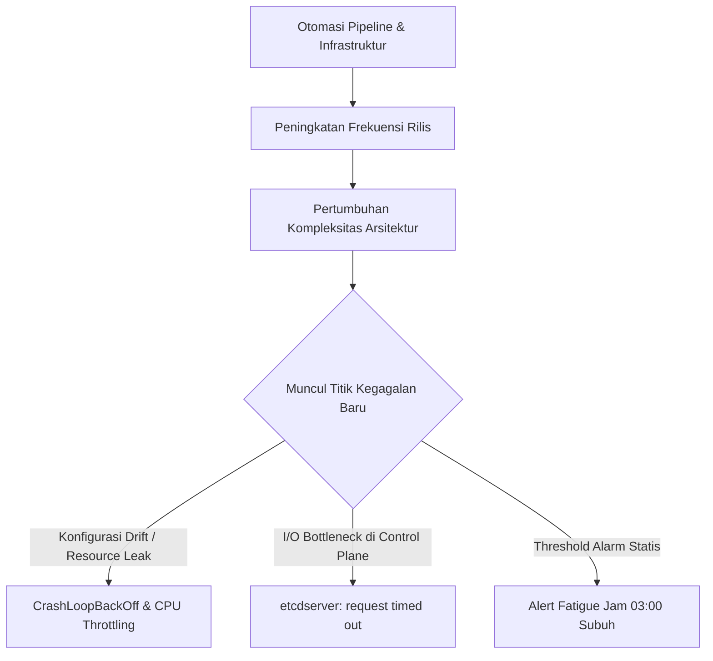

Dulu saya sempat mempercayai janji manis materi promosi di internet: tulis skrip Terraform, pasang pipeline CI/CD, nyalakan kluster Kubernetes, lalu nikmati kopi hangat sembari menunggu gaji masuk. Istilah populernya: *automate and chill*. 

Namun, sistem produksi selalu punya cara tersendiri untuk menguji realitas. Pukul 03.17 dini hari, ponsel di samping bantal bergetar kencang tanpa henti. Layar laptop yang menyilaukan mata langsung menyajikan pemandangan menegangkan: dua belas pod layanan transaksi gagal beroperasi secara serempak, diiringi pesan galat kritis pada *control plane*.

> ### 🎯 Ringkasan Utama (Key Takeaways)
> 
> 1. **Otomasi menggeser bentuk pekerjaan, bukan meniadakannya**: Tugas manual repetitif (*toil*) berganti menjadi penanganan interaksi sistem terdistribusi yang menuntut analisis mendalam.
> 2. **Lapisan abstraksi melahirkan titik kegagalan baru**: Galat seperti *CrashLoopBackOff* (Exit Code 137) dan *etcd timeout* berpindah dari kelalaian manusia ke hambatan alokasi sumber daya (*resource limits*) serta latensi media simpan (*disk I/O latency*).
> 3. **Observabilitas berbasis SLO meredam badai alarm**: Alarm ambang batas statis memicu kelelahan alarm (*alert fatigue*), sedangkan *multi-window burn rate alerting* memastikan tim *on-call* hanya merespons ancaman nyata terhadap kuota keandalan (*error budget*).
> 4. **Jaring pengaman rilis progresif menjaga ritme produksi**: Validasi manifes otomatis di pipeline dan rilis bertahap (*canary deployment*) dengan pemulihan otomatis (*automated rollback*) mencegah kesalahan konfigurasi merusak kluster.

<figure>
  
  <figcaption>Kontras tajam antara ekspektasi populer dunia DevOps ("Fake DevOps Job") dengan realitas operasional harian para insinyur SRE dan platform ("Real DevOps Job").</figcaption>
</figure>

---

## 1. Anatomi Paradoks Otomasi di Lingkungan Produksi

Prinsip dasar *Site Reliability Engineering* (SRE) mendorong kita untuk memangkas *toil* (pekerjaan repetitif manual). Masalahnya, banyak tim menyangka bahwa mengotomasi alur deployment berarti sistem menjadi kebal terhadap kerusakan.

Otomasi tanpa disiplin observabilitas ibarat memasang pedal gas mobil balap tanpa melengkapinya dengan rem otomatis. Kecepatan pengiriman kode meningkat drastis, tetapi potensi benturan di jalan raya produksi ikut melonjak.



Ketika alur rilis berlangsung instan, puluhan pembaruan kode meluncur setiap pekan. Setiap baris baru menyimpan peluang *memory leak* (kebocoran alokasi memori), *race condition* (kondisi perebutan sumber daya), hingga kesalahan parameter *runtime*. Beban kerja insinyur tidak lenyap, melainkan bertransformasi menjadi tugas investigasi anomali sistem terdistribusi.

---

## 2. Membedah Dua Galat Klasik: Dari CrashLoopBackOff hingga etcd Timeout

Terminal pada gambar di atas memuat dua baris pesan yang menjadi momok bagi setiap praktisi operasional:

```text
$ kubectl get pods
NAME                                READY   STATUS             RESTARTS   AGE
api-6f7d9f6c78-abc12                0/1     CrashLoopBackOff   47         2h
payment-svc-5c7f9d8cbd-xyz98        1/1     Running            0          23m

Error from server (InternalError):
etcdserver: request timed out
```

Dua pesan ini menggambarkan dua spektrum masalah yang berbeda: tingkat aplikasi dan tingkat fondasi kluster.

### A. CrashLoopBackOff: Siklus Kematian Kontainer
Status `CrashLoopBackOff` terjadi saat Kubernetes mencoba menjalankan kontainer secara berulang, namun proses di dalamnya langsung terhenti (*exit*) dengan kode kegagalan. Tiga biang keladi utamanya:
* **OOMKilled (Exit Code 137)**: Aplikasi menyerap memori melebihi batas `resources.limits.memory`. Linux Kernel memanggil *OOM Killer* untuk mematikan proses seketika.
* **Hilangnya Konfigurasi Sensitif**: Aplikasi gagal menemukan variabel *environment* atau *secret* penting saat fase booting awal.
* **Kegagalan Liveness Probe**: Pemeriksaan kesehatan aplikasi terlambat merespons akibat beban kerja tinggi atau pengaturan `timeoutSeconds` yang terlalu agresif, sehingga *kubelet* terus me-restart kontainer yang sebenarnya sedang sibuk bekerja.

### B. etcd Timeout: Kelumpuhan Otak Kluster
Pesan `etcdserver: request timed out` menandakan bahaya di tingkat fondasi. etcd adalah otak dan sistem saraf pusat Kubernetes. Komponen ini mengandalkan algoritma konsensus Raft yang sangat sensitif terhadap latensi penulisan ke media penyimpanan (*fsync latency*).

Jika media simpan pada *master node* kehabisan IOPS (*Input/Output Operations Per Second*) atau ukuran basis data etcd membengkak melampaui batas wajar (2GB sampai 8GB), pemilihan pemimpin (*leader election*) akan terganggu. Aliran data terhambat, mengakibatkan seluruh perintah `kubectl` dan mutasi API lumpuh seketika.

---

## 3. Matriks Perbandingan: Mitos Populer vs Realitas Produksi

<div class="overflow-x-auto my-6">
  <table class="w-full text-left border-collapse border border-border-subtle bg-surface-secondary">
    <thead>
      <tr class="border-b border-border-subtle bg-surface-tertiary">
        <th class="p-3 font-semibold text-text-primary">Aspek Operasional</th>
        <th class="p-3 font-semibold text-text-primary">Mitos Populer ("Fake DevOps")</th>
        <th class="p-3 font-semibold text-text-primary">Realitas Lapangan ("Real DevOps")</th>
        <th class="p-3 font-semibold text-text-primary">Solusi Rekayasa Berkelanjutan</th>
      </tr>
    </thead>
    <tbody class="divide-y divide-border-subtle text-text-secondary text-sm">
      <tr>
        <td class="p-3 font-medium text-text-primary">Peran Otomasi</td>
        <td class="p-3">Otomasi sekali lalu sistem berjalan mandiri selamanya.</td>
        <td class="p-3">Otomasi menuntut pemeliharaan rutin mengikuti evolusi kode aplikasi.</td>
        <td class="p-3">GitOps deklaratif dengan ArgoCD atau Flux disertai pengujian *dry-run* otomatis.</td>
      </tr>
      <tr>
        <td class="p-3 font-medium text-text-primary">Kondisi Kluster</td>
        <td class="p-3">Semua grafik dasbor selalu hijau tanpa kendala.</td>
        <td class="p-3">Lonjakan CPU mendadak, OOMKilled, dan isolasi jaringan (*network partition*).</td>
        <td class="p-3">Penetapan batas alokasi CPU/Memory realistis dan HPA (*Horizontal Pod Autoscaler*).</td>
      </tr>
      <tr>
        <td class="p-3 font-medium text-text-primary">Sistem Notifikasi</td>
        <td class="p-3">Notifikasi santai di jam kerja normal.</td>
        <td class="p-3">PagerDuty meraung jam 03.17 dini hari akibat alarm statis yang bising.</td>
        <td class="p-3">Multi-window burn rate alerting berbasis SLO untuk menyingkirkan alarm palsu.</td>
      </tr>
      <tr>
        <td class="p-3 font-medium text-text-primary">Konfigurasi YAML</td>
        <td class="p-3">Salin tempel konfigurasi dari internet lalu langsung jalan.</td>
        <td class="p-3">Kesalahan indentasi dan pergeseran konfigurasi (*configuration drift*) antar-lingkungan.</td>
        <td class="p-3">Validasi skema dengan `kube-linter`, `yamllint`, atau Open Policy Agent (OPA).</td>
      </tr>
      <tr>
        <td class="p-3 font-medium text-text-primary">Jadwal Rilis</td>
        <td class="p-3">Deploy santai Jumat sore lalu langsung menikmati liburan.</td>
        <td class="p-3">Insiden akhir pekan akibat rilis massal tanpa pengujian bertahap (*canary*).</td>
        <td class="p-3">Rilis bertahap (*canary deployment*), rollback otomatis, dan pembatasan rilis saat jam rawan.</td>
      </tr>
    </tbody>
  </table>
</div>

---

## 4. Mengubah Kekacauan Menjadi Ketenangan: Tiga Pilar Rekayasa

Untuk keluar dari jebakan operasional yang melelahkan dan mencapai kestabilan sistem yang berkelanjutan, kami menerapkan tiga pilar perbaikan:

### 1. Rasionalisasi Observabilitas dan Alarm
Alarm berbasis ambang batas CPU 80% ibarat alarm mobil di kawasan padat perumahan: setiap kali kucing melompat ke kap mesin, alarm meraung keras. Lama-kelamaan, saat ada pencuri sungguhan, semua warga memilih menutup telinga karena sudah mengalami kelelahan alarm (*alert fatigue*).

Kami mengganti alarm statis dengan alarm berbasis *Service Level Objectives* (SLO). Sistem hanya akan menghubungi petugas *on-call* jika laju konsumsi *error budget* mengancam ketersediaan layanan pengguna. Pembahasan teknis mengenai pendekatan ini dapat dibaca pada artikel [Implementasi Error Budget di Produksi: Praktik Nyata Melampaui Teori SRE]({{ '/2026/08/28/error-budget-in-production/' | relative_url }}).

### 2. Standarisasi Rantai Perkakas (Toolchain)
Menambah perkakas baru pada alur kerja yang bermasalah tidak akan menyelesaikan kekacauan, melainkan melipatgandakan kompleksitas. Sebagaimana diulas dalam tulisan [Mengatasi Overload Tooling dalam DevOps Modern]({{ '/2026/08/16/overload-tooling-devops-modern/' | relative_url }}), kami merampingkan ekosistem kerja ke beberapa standar inti yang dipahami secara mendalam oleh seluruh anggota tim.

### 3. Validasi Manifes di Awal dan Rilis Progresif
Kami memasang gerbang validasi otomatis pada repositori *infrastructure-as-code* sebelum konfigurasi mencapai kluster:

```bash
# Validasi struktur sintaks dan indentasi YAML
yamllint -c .yamllint.yml kubernetes/

# Validasi praktik keamanan manifes Kubernetes
kube-linter lint kubernetes/

# Uji kepatuhan kebijakan operasional (policy compliance)
conftest test kubernetes/ -p policy/
```

Melalui pemeriksaan otomatis (*shift-left testing*) dan rilis bertahap (*canary deployment*), kami dapat mendeteksi anomali pada 5% trafik pengguna awal dan memicu pemulihan otomatis (*automated rollback*) sebelum insiden meluas ke seluruh basis pengguna.

---

## Referensi & Bacaan Lanjutan

* [Google SRE Book: Eliminating Toil](https://sre.google/sre-book/eliminating-toil/)
* [Kubernetes Documentation: Troubleshoot Applications](https://kubernetes.io/docs/tasks/debug/debug-application/)
* [etcd Documentation: Hardware Recommendations & Latency](https://etcd.io/docs/latest/op-guide/hardware/)
* [DORA Research: State of DevOps Report](https://dora.dev/research/)

[← Kembali ke Daftar Artikel]({{ '/blog/' | relative_url }})
