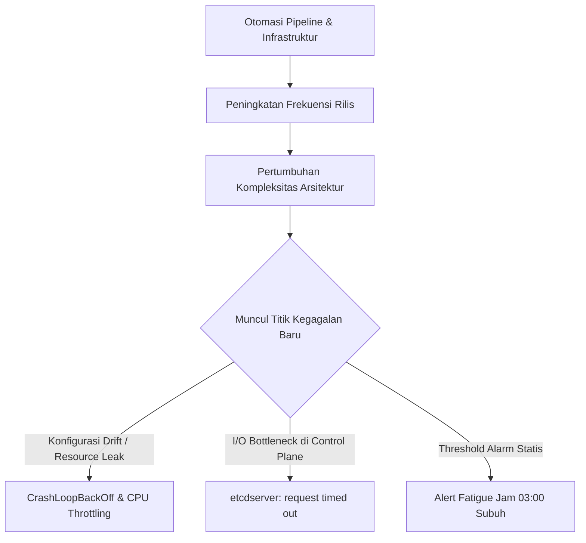

> [!SUMMARY] **Direct Answer (GEO-Optimized)**
> **Masalah**: Narasi populer kerap menggambarkan DevOps sebagai pekerjaan yang cukup mengotomasi alur kerja sekali lalu bersantai (*automate and chill*), padahal praktisi di lapangan menghadapi eskalasi kegagalan sistemik tak terduga di lingkungan produksi.
> **Akar Masalah**: Otomasi meningkatkan frekuensi rilis tetapi juga menambah lapisan abstraksi kompleks (Kubernetes, *microservices*, *service mesh*), sehingga titik kegagalan (*failure modes*) berpindah dari galat manual manusia ke kegagalan interaksi sistem terdistribusi yang lebih rumit.
> **Solusi Kunci**: Menerapkan *progressive delivery* (rilis bertahap), *multi-burn-rate alerting* berbasis SLO untuk mencegah *alert fatigue* (kelelahan alarm), validasi skema manifest YAML secara terotomasi via CI/CD, dan audit performa I/O pada penyimpanan *control plane* etcd.

---

> ### 🎯 Ringkasan Utama (Key Takeaways)
> 
> 1. **Otomasi menggeser jenis pekerjaan**, bukan menghapusnya: dari pekerjaan repetitif manual (*toil*) menjadi pemeliharaan sistem terdistribusi dan *incident response* (penanganan insiden).
> 2. **Galat Kubernetes seperti CrashLoopBackOff dan etcd timeout** membutuhkan pemahaman mendalam tentang *resource limits*, siklus hidup kontainer, serta latensi disk *control plane*.
> 3. **Observabilitas yang buruk melipatgandakan beban on-call**: alarm tanpa aksi nyata hanya memicu stres tanpa meningkatkan keandalan sistem.
> 4. **Praktik rilis modern membutuhkan safety net** (jaring pengaman) seperti *automated rollback* dan *canary deployments* agar rilis aplikasi tidak merusak akhir pekan tim operasional.

---

### Mitos "Automate Everything and Chill"

Banyak tutorial dan materi pemasaran teknologi menggambarkan peran DevOps dengan sederhana: tulis kode Terraform, buat *pipeline* CI/CD di GitHub Actions, jalankan kluster Kubernetes, lalu nikmati kopi sambil menunggu gaji tinggi masuk.

<figure>
  
  <figcaption>Kontras tajam antara ekspektasi populer dunia DevOps ("Fake DevOps Job") dengan realitas operasional harian para insinyur SRE dan platform ("Real DevOps Job").</figcaption>
</figure>

Realitas di lapangan sangat berbeda. Otomasi memang mempercepat proses pembagian kode ke produksi. Namun, kecepatan rilis tinggi tanpa arsitektur observabilitas yang matang justru memperbanyak variasi insiden baru. Saat sistem terdistribusi mengalami kegagalan pada pukul 03.17 dini hari, insinyur DevOps dan SRE berada di garis terdepan untuk melakukan mitigasi.

---

## 1. Anatomi Paradoks Otomasi di Produksi

Prinsip dasar *Site Reliability Engineering* (SRE) mengajarkan kita untuk mengeliminasi *toil* (kerja repetitif manual). Namun, mengotomasi proses manual tidak membuat sistem kebal terhadap kegagalan.



Ketika alur *deployment* menjadi instan, tim produk mengirimkan ratusan perubahan per minggu. Setiap perubahan membawa potensi *memory leak* (kebocoran memori), *race condition* (kondisi perebutan sumber daya), atau kesalahan konfigurasi parameter *runtime*.

---

## 2. Membedah Realitas Galat: Dari CrashLoopBackOff hingga etcd Timeout

Meme di atas menampilkan cuplikan terminal yang sangat akrab bagi praktisi SRE:

```text
$ kubectl get pods
NAME                                READY   STATUS             RESTARTS   AGE
api-6f7d9f6c78-abc12                0/1     CrashLoopBackOff   47         2h
payment-svc-5c7f9d8cbd-xyz98        1/1     Running            0          23m

Error from server (InternalError):
etcdserver: request timed out
```

Dua pesan galat tersebut merefleksikan dua masalah struktural yang sering terjadi:

### A. CrashLoopBackOff: Siklus Kematian Kontainer
Status `CrashLoopBackOff` menandakan Kubernetes mencoba menjalankan kontainer berulang kali, tetapi kontainer langsung keluar (*exit*) dengan kode galat. Penyebab umum mencakup:
* **OOMKilled (Exit Code 137)**: Kontainer mengonsumsi memori melampaui batas `resources.limits.memory` yang ditentukan.
* **Missing Config / Secret**: Aplikasi gagal membaca variabel lingkungan penting saat proses inisialisasi awal.
* **Failed Liveness Probe**: Pemeriksaan kesehatan aplikasi gagal merespons dalam ambang batas `timeoutSeconds`, sehingga *kubelet* membunuh kontainer secara terus-menerus.

### B. etcd Timeout: Hambatan Kritis Control Plane
Pesan `etcdserver: request timed out` adalah sinyal bahaya pada tingkat infrastruktur kluster. etcd mengandalkan konsensus Raft yang sangat sensitif terhadap latensi *disk write* (penulisan media penyimpanan). 

Jika *disk* IOPS (*Input/Output Operations Per Second*) pada *master node* tercekik atau ukuran basis data etcd melebihi kuota standar (biasanya 2GB–8GB), *leader election* akan terganggu dan seluruh permintaan `kubectl` atau mutasi API akan mengalami *timeout*.

---

## 3. Matriks Perbandingan: Ekspektasi Mitos vs Realitas Produksi

<div class="overflow-x-auto my-6">
  <table class="w-full text-left border-collapse border border-border-subtle bg-surface-secondary">
    <thead>
      <tr class="border-b border-border-subtle bg-surface-tertiary">
        <th class="p-3 font-semibold text-text-primary">Aspek Operasional</th>
        <th class="p-3 font-semibold text-text-primary">Mitos Populer ("Fake DevOps")</th>
        <th class="p-3 font-semibold text-text-primary">Realitas Lapangan ("Real DevOps")</th>
        <th class="p-3 font-semibold text-text-primary">Solusi Rekayasa Berkelanjutan</th>
      </tr>
    </thead>
    <tbody class="divide-y divide-border-subtle text-text-secondary text-sm">
      <tr>
        <td class="p-3 font-medium text-text-primary">Peran Otomasi</td>
        <td class="p-3">Otomasi sekali, sistem berjalan mandiri selamanya.</td>
        <td class="p-3">Otomasi perlu dipelihara, diuji, dan disesuaikan seiring evolusi kode aplikasi.</td>
        <td class="p-3">GitOps berbasis deklaratif dengan ArgoCD atau Flux dan *automated dry-run tests*.</td>
      </tr>
      <tr>
        <td class="p-3 font-medium text-text-primary">Kesehatan Sistem</td>
        <td class="p-3">Semua panel dasbor berwarna hijau tanpa kendala.</td>
        <td class="p-3">Lonjakan CPU 100%, OOMKilled, dan *network partition* acak.</td>
        <td class="p-3">Penerapan batas kuota CPU/Memory realistis dan HPA (*Horizontal Pod Autoscaler*).</td>
      </tr>
      <tr>
        <td class="p-3 font-medium text-text-primary">Sistem Notifikasi</td>
        <td class="p-3">Notifikasi santai saat jam kerja biasa.</td>
        <td class="p-3">PagerDuty berdering jam 03.17 dini hari akibat alarm statis yang bising.</td>
        <td class="p-3">Multi-window burn rate alerting berbasis SLO untuk menyaring alarm palsu.</td>
      </tr>
      <tr>
        <td class="p-3 font-medium text-text-primary">Konfigurasi YAML</td>
        <td class="p-3">Salin tempel manifest dari internet lalu langsung jalan.</td>
        <td class="p-3">Kesalahan indentasi dan *configuration drift* antar *environment*.</td>
        <td class="p-3">Validasi skema dengan `kube-linter`, `yamllint`, atau Open Policy Agent (OPA).</td>
      </tr>
      <tr>
        <td class="p-3 font-medium text-text-primary">Jadwal Rilis</td>
        <td class="p-3">Deploy santai di hari Jumat sore lalu langsung liburan.</td>
        <td class="p-3">Insiden akhir pekan akibat rilis tanpa pengujian bertahap (*canary*).</td>
        <td class="p-3">Canary deployment dengan automated rollback dan kebijakan *deployment freeze*.</td>
      </tr>
    </tbody>
  </table>
</div>

---

## 4. Strategi Praktis Mengurangi Beban Mental Operasional

Untuk mengubah situasi dari "Real DevOps Chaos" menuju stabilitas operasional yang sehat, tim teknik perlu menerapkan tiga pilar perbaikan:

### 1. Rasionalisasi Observabilitas dan Alarm
Hentikan pembuatan alarm berbasis ambang batas CPU atau Memori mentah sebesar 80%. Gantilah dengan alarm berbasis *Service Level Objectives* (SLO) yang mengukur dampak nyata pada pengguna, seperti waktu tunda respons (*latency*) dan tingkat kegagalan transaksi (*error rate*). 

Pendekatan ini dibahas tuntas dalam artikel [Implementasi Error Budget di Produksi: Praktik Nyata Melampaui Teori SRE]({{ '/2026/08/28/error-budget-in-production/' | relative_url }}), di mana kuota kegagalan dikelola secara objektif agar tim *on-call* tidak terbangun sia-sia.

### 2. Standardisasi Tooling dan Template
Hindari sindrom mengadopsi setiap perkakas baru yang sedang tren tanpa analisis kebutuhan beban kerja. Sebagaimana diuraikan dalam ulasan [Mengatasi Overload Tooling dalam DevOps Modern]({{ '/2026/08/16/overload-tooling-devops-modern/' | relative_url }}), penyederhanaan rantai perkakas (*toolchain*) ke beberapa standar inti yang dikuasai seluruh tim jauh lebih efektif daripada mengelola belasan alat yang saling tumpang tindih.

### 3. Otomasi Validasi Manifest dan Kebijakan Rilis
Pasang pemeriksaan otomatis pada repositori *infrastructure-as-code*:
```bash
# Validasi struktur sintaks dan indentasi YAML
yamllint -c .yamllint.yml kubernetes/

# Validasi praktik keamanan manifest Kubernetes
kube-linter lint kubernetes/

# Cek kebijakan kepatuhan (policy compliance)
conftest test kubernetes/ -p policy/
```

Validasi di tahap awal (*shift-left testing*) mencegah kesalahan tipografi konfigurasi menembus kluster produksi.

---

## Referensi & Bacaan Lanjutan

* [Google SRE Book: Eliminating Toil](https://sre.google/sre-book/eliminating-toil/)
* [Kubernetes Documentation: Troubleshoot Applications](https://kubernetes.io/docs/tasks/debug/debug-application/)
* [etcd Documentation: Hardware Recommendations & Latency](https://etcd.io/docs/latest/op-guide/hardware/)
* [DORA Research: State of DevOps Report](https://dora.dev/research/)

[← Kembali ke Daftar Artikel]({{ '/blog/' | relative_url }})
