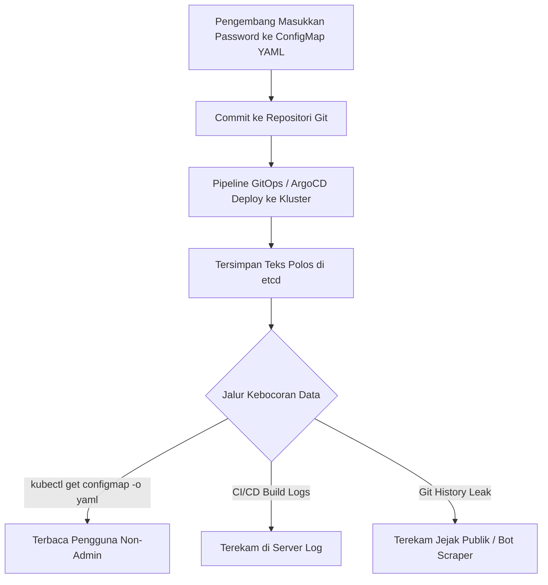

Di lingkungan *staging*, semuanya berawal dari niat sederhana: "Biar cepat, masukkan koneksi database ke ConfigMap dulu." Beberapa minggu kemudian, konfigurasi darurat tersebut tanpa sengaja lolos ke repositori utama dan meluncur mulus ke kluster produksi. 

Bahkan di dunia maya yang penuh ancaman siber, ada satu tindakan operasional yang sanggup membuat insinyur paling berpengalaman bergidik ngeri: menyimpan kata sandi dan kunci rahasia (*secret keys*) di dalam ConfigMap Kubernetes.

> ### 🎯 Ringkasan Utama (Key Takeaways)
> 
> 1. **ConfigMap dirancang transparan, bukan rahasia**: Data disimpan dalam format teks polos (*plaintext*) tanpa enkripsi bawaan dan dapat dibaca oleh siapa saja dengan hak akses *read-only*.
> 2. **Perbedaan fundamental dengan Kubernetes Secret**: Walaupun *Secret* bawaan hanya menggunakan *base64 encoding*, ia mendukung enkripsi pada media simpan (*encryption at rest*) di etcd dan pembatasan izin RBAC yang jauh lebih granular.
> 3. **GitOps memperluas radius paparan bahaya**: Menyimpan ConfigMap berisi kredensial di repositori Git otomatis menyebarkan rahasia ke seluruh riwayat komit (*commit history*) dan sistem CI/CD.
> 4. **Gunakan External Secrets Operator (ESO) sebagai standar modern**: Sinkronisasi rahasia secara otomatis dari AWS Secrets Manager atau HashiCorp Vault langsung ke kluster tanpa meninggalkan jejak di kode sumber.

<figure>
  
  <figcaption>Ilustrasi meme: Bahkan narapidana paling tangguh pun memilih menjauh dari insinyur yang nekat menyimpan kata sandi di ConfigMap Kubernetes.</figcaption>
</figure>

---

## 1. Anatomi Masalah: Mengapa Tindakan Ini Sangat Berbahaya?

ConfigMap diciptakan oleh tim perancang Kubernetes untuk memisahkan konfigurasi aplikasi (*non-confidential data*) dari kode biner kontainer. Komponen ini ditujukan untuk variabel seperti *port number*, *log level*, atau alamat URL publik.

Ketika data sensitif dipaksakan masuk ke ConfigMap, sistem mengalami tiga kerentanan kritis:

*   **Penyimpanan Teks Polos (*Plaintext Storage*)**: ConfigMap tersimpan mentah di dalam basis data etcd. Siapa pun yang memiliki akses ke penyimpanan kluster dapat membaca kredensial tanpa perlu proses dekripsi.
*   **Paparan Akses RBAC yang Longgar**: Di banyak organisasi, hak akses `get` dan `list` untuk `configmaps` diberikan secara luas kepada tim pengembang untuk keperluan pemecahan masalah (*troubleshooting*). Menaruh rahasia di sini sama saja dengan membagikan kunci brankas ke seluruh kantor.
*   **Pencatatan Log dan Jejak Audit Terbuka**: Perintah rutin seperti `kubectl describe configmap` atau log dari pipeline CI/CD akan menampilkan kata sandi secara gamblang di layar terminal maupun dasbor pemantauan.



---

## 2. Matriks Komparasi: ConfigMap vs Kubernetes Secret vs External Secrets Operator

Untuk memahami posisi keamanan setiap komponen, perhatikan matriks keputusan berikut:

<div class="overflow-x-auto my-6">
  <table class="w-full text-left border-collapse border border-border-subtle bg-surface-secondary">
    <thead>
      <tr class="border-b border-border-subtle bg-surface-tertiary">
        <th class="p-3 font-semibold text-text-primary">Fitur / Kriteria</th>
        <th class="p-3 font-semibold text-text-primary">ConfigMap</th>
        <th class="p-3 font-semibold text-text-primary">Native Secret</th>
        <th class="p-3 font-semibold text-text-primary">External Secrets Operator (ESO)</th>
      </tr>
    </thead>
    <tbody class="divide-y divide-border-subtle text-text-secondary text-sm">
      <tr>
        <td class="p-3 font-medium text-text-primary">Tujuan Penggunaan</td>
        <td class="p-3">Konfigurasi publik (port, endpoint, flag).</td>
        <td class="p-3">Data sensitif dasar (API token, password).</td>
        <td class="p-3">Manajemen rahasia terpusat lintas *cloud* / *vault*.</td>
      </tr>
      <tr>
        <td class="p-3 font-medium text-text-primary">Format Penyimpanan</td>
        <td class="p-3">Teks polos (*plaintext*).</td>
        <td class="p-3">Base64 (bukan enkripsi, hanya encoding).</td>
        <td class="p-3">Terenkripsi di KMS / Vault, diinjeksi saat *runtime*.</td>
      </tr>
      <tr>
        <td class="p-3 font-medium text-text-primary">Enkripsi di etcd</td>
        <td class="p-3">Tidak didukung secara khusus.</td>
        <td class="p-3">Mendukung *EncryptionConfiguration* KMS.</td>
        <td class="p-3">Mendukung *native Secret* dengan proteksi KMS.</td>
      </tr>
      <tr>
        <td class="p-3 font-medium text-text-primary">Integrasi GitOps</td>
        <td class="p-3">Aman disimpan di Git (jika tanpa kredensial).</td>
        <td class="p-3">Berbahaya di-commit langsung ke Git.</td>
        <td class="p-3">Sangat aman (hanya manifes referensi yang di-commit).</td>
      </tr>
      <tr>
        <td class="p-3 font-medium text-text-primary">Rotasi Otomatis</td>
        <td class="p-3">Manual dan memicu *restart* pod.</td>
        <td class="p-3">Manual tanpa orkestrator eksternal.</td>
        <td class="p-3">Otomatis sinkron saat rahasia di-update di penyedia *cloud*.</td>
      </tr>
    </tbody>
  </table>
</div>

---

## 3. Langkah Remediasi: Tiga Pilar Tata Kelola Rahasia

Jika sistem Anda saat ini masih menyimpan variabel sensitif di dalam ConfigMap, terapkan tiga langkah migrasi bertahap berikut:

### A. Terapkan Kebijakan Pencegahan (*Guardrails & Policy Enforcement*)
Cegah kesalahan sebelum mencapai kluster menggunakan perkakas kebijakan seperti Kyverno atau Open Policy Agent (OPA) Gatekeeper. Manifes kebijakan dapat secara otomatis menolak pembuatan ConfigMap yang mengandung kunci berbahaya:

```yaml
apiVersion: kyverno.io/v1
kind: ClusterPolicy
metadata:
  name: block-passwords-in-configmaps
spec:
  validationFailureAction: Enforce
  rules:
  - name: check-sensitive-keys
    match:
      any:
      - resources:
          kinds:
          - ConfigMap
    validate:
      message: "Dilarang menyimpan kunci sensitif (password, secret, apiKey) di dalam ConfigMap!"
      pattern:
        data:
          X(password): null
          X(api_key): null
          X(secret_key): null
```

Kebijakan di atas melengkapi prinsip pembatasan platform sebagaimana diulas dalam [Guardrails Keamanan Agen AI di EKS]({{ '/2026/08/16/membangun-guardrails-keamanan-agen-ai-eks/' | relative_url }}).

### B. Migrasi ke External Secrets Operator (ESO)
Alih-alih menyimpan *Secret* statis di repositori, gunakan ESO untuk menarik rahasia langsung dari AWS Secrets Manager atau HashiCorp Vault. Pengembang hanya perlu membuat manifes `ExternalSecret`:

```yaml
apiVersion: external-secrets.io/v1beta1
kind: ExternalSecret
metadata:
  name: payment-db-credentials
spec:
  refreshInterval: "1h"
  secretStoreRef:
    name: aws-secrets-manager
    kind: ClusterSecretStore
  target:
    name: payment-db-secret
    creationPolicy: Owner
  data:
  - secretKey: DB_PASSWORD
    remoteRef:
      key: prod/payment/database
      property: password
```

### C. Isolasi Hak Akses RBAC (*Least Privilege*)
Pastikan akun layanan (*ServiceAccounts*) dan pengembang hanya memiliki akses baca ke ConfigMap non-sensitif, sedangkan akses ke *Secrets* dibatasi secara ketat hanya untuk komponen yang benar-benar membutuhkan.

---

## 4. Rangkuman Aksi Strategis

Tiga tindakan yang bisa Anda jalankan hari ini untuk mengamankan kluster:

1. **Jalankan Audit Kluster**: Gunakan perintah `kubectl get configmaps -A -o yaml | grep -iE 'password|token|secret|apiKey'` untuk memindai kemungkinan adanya kredensial tersembunyi.
2. **Aktifkan Enkripsi etcd**: Pastikan kluster produksi Anda telah mengonfigurasi *Envelope Encryption* berbasis AWS KMS atau GCP Cloud KMS untuk seluruh data *Secret*.
3. **Pasang Git Pre-Commit Hook**: Integrasikan perkakas seperti `gitleaks` atau `trufflehog` pada repositori tim untuk menggagalkan *commit* berisi data rahasia sebelum terkirim ke server pusat.

---

> Menyimpan kredensial di ConfigMap bukan sekadar kelalaian sintaksis; itu adalah deklarasi bahwa keamanan sistem Anda hanyalah ilusi yang menunggu waktu untuk runtuh.

---

## Mari Berdiskusi dan Bertindak

*   📤 **Bagikan Wawasan**: Sebarkan artikel ini kepada rekan tim pengembang agar tidak ada lagi kata sandi yang tersasar di ConfigMap.
*   💡 **Jelajahi Portofolio & Arsitektur**: Simak catatan teknis rekayasa keandalan sistem lainnya di [Terminal CV]({{ '/terminal/' | relative_url }}) atau baca ulasan [Implementasi Error Budget di Produksi]({{ '/2026/08/28/error-budget-in-production/' | relative_url }}).
*   💬 **Diskusi Terarah**: Bagaimana strategi tim Anda dalam mengelola rotasi rahasia di Kubernetes tanpa menimbulkan *downtime* aplikasi? Tuliskan pengalaman Anda di kolom komentar!

---

<div class="p-4 rounded-xl border border-border-subtle bg-surface-secondary my-6">
  <h3 class="text-base font-semibold text-text-primary mb-2">💡 Pojok Bahasa Inggris</h3>
  <ul class="text-sm text-text-secondary space-y-2 list-disc list-inside">
    <li><strong>Secret Sprawl</strong>: Kondisi ketika kredensial, token API, dan kata sandi tersebar tak terkendali di berbagai repositori, file konfigurasi, log, atau kluster tanpa pengawasan terpusat.</li>
    <li><strong>Blast Radius</strong>: Skala atau luasnya dampak kerusakan yang ditimbulkan pada infrastruktur dan bisnis ketika sebuah insiden keamanan atau kegagalan sistem terjadi.</li>
  </ul>
</div>

[← Kembali ke Daftar Artikel]({{ '/blog/' | relative_url }})
