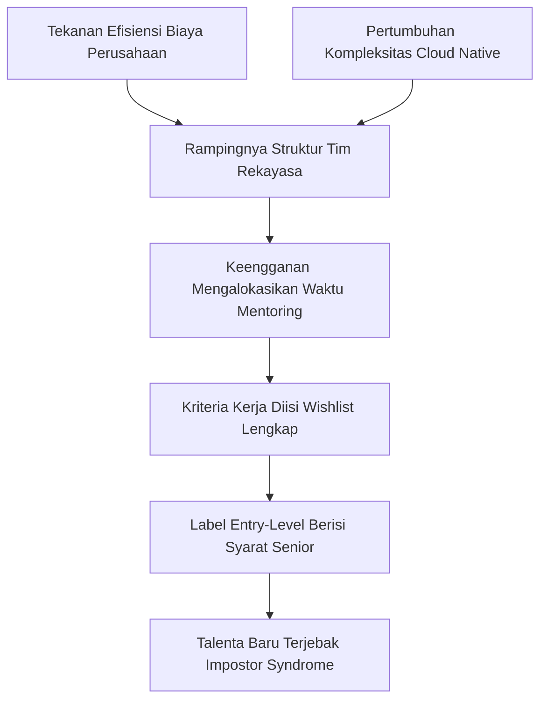

Pernahkah Anda membuka portal lowongan kerja dan menemukan judul: *"Entry-Level DevOps Engineer — Syarat: Minimal 5 tahun pengalaman produksi"*?

Rasanya persis seperti adegan ikonik dalam serial *Squid Game*: jika tahun 2019 kita diberi tantangan memotong permen dalgona bergambar payung sederhana, sekarang kita disodorkan pola fraktal segitiga bersusun yang mustahil dipotong tanpa retak.

> ### 🎯 Ringkasan Utama (Key Takeaways)
> 
> 1. **Inflasi Persyaratan (*Credential Inflation*) Nyata Terjadi**: Label *"entry-level"* kerap disalahgunakan oleh perusahaan untuk mencari insinyur berpengalaman tingkat menengah dengan anggaran gaji pemula.
> 2. **Pergeseran Paradigma dari SysAdmin ke Platform & AI**: Lanskap tidak lagi berhenti pada otomasi skrip *bash* dan server CI/CD, melainkan merambah orkestrasi kluster, rekayasa keamanan (*DevSecOps*), hingga infrastruktur komputasi kecerdasan buatan (*GPU & MLOps*).
> 3. **Taktik T-Shaped Engineer**: Alih-alih tenggelam mencoba menguasai puluhan perkakas secara bersamaan, bangun fondasi fundamental yang kokoh pada 1–2 pilar inti sebelum melebarkan sayap.
> 4. **Portofolio Pembuktian Mengalahkan Deretan Akronim**: Membangun laboratorium mandiri (*homelab*) yang mendokumentasikan pemecahan insiden nyata jauh lebih memikat perekrut dibanding daftar sertifikasi teoretis.

<figure>
  
  <figcaption>Perjalanan ekspektasi industri: dari kurikulum fondasi 2019 yang terarah menjadi tumpukan beban kerja fraktal di era modern.</figcaption>
</figure>

---

## 1. Anatomi Pergeseran: Mengapa Standar Pemula Melonjak Drastis?

Tahun 2019, jalur masuk menuju dunia rekayasa operasi infrastruktur relatif bersih dan manusiawi. Seorang kandidat pemula cukup memahami dasar-dasar sistem operasi Linux, fasih menggunakan kontrol versi (*Git*), mampu merangkai *pipeline* sederhana pada server Jenkins, memahami konsep dasar kontainer Docker, serta membawa rasa ingin belajar (*willingness to learn*) yang tinggi.

Namun lanskap teknologi bergerak dengan kecepatan eksponensial. Hari ini, daftar persyaratan kerja pemula tampak seperti daftar inventaris arsitek infrastruktur berpengalaman:

  <table class="w-full text-left border-collapse border border-border-card text-sm">
    <thead class="bg-surface-elevated text-text-primary">
      <tr>
        <th class="p-3 border-b border-border-card">Pilar Kompetensi</th>
        <th class="p-3 border-b border-border-card">Ekspektasi 2019 (Fondasi)</th>
        <th class="p-3 border-b border-border-card">Tuntutan Hari Ini (Fraktal)</th>
        <th class="p-3 border-b border-border-card">Dampak Terhadap Rekayasa</th>
      </tr>
    </thead>
    <tbody class="divide-y divide-border-card text-text-muted">
      <tr>
        <td class="p-3 font-medium text-text-primary">Infrastruktur Komputasi</td>
        <td class="p-3">Satu penyedia *cloud* (AWS/GCP) atau server fisik berbasis Linux.</td>
        <td class="p-3">*Multi-cloud hybrid*, arsitektur *bare-metal*, dan kluster akselerator GPU.</td>
        <td class="p-3">Kompleksitas jaringan terdistribusi dan abstraksi latensi.</td>
      </tr>
      <tr>
        <td class="p-3 font-medium text-text-primary">Orkestrasi Beban Kerja</td>
        <td class="p-3">Docker Compose atau konfigurasi VM berbasis skrip.</td>
        <td class="p-3">Kubernetes (EKS/GKE), Service Mesh, dan arsitektur *microservices*.</td>
        <td class="p-3">Beban kognitif (*cognitive load*) tinggi dalam memahami manifes deklaratif.</td>
      </tr>
      <tr>
        <td class="p-3 font-medium text-text-primary">Pola Integrasi & Rilis</td>
        <td class="p-3">Pipeline CI/CD terpusat (Jenkins/GitLab CI).</td>
        <td class="p-3">Pendekatan *GitOps* (ArgoCD/Flux) dengan model rekonsiliasi deklaratif.</td>
        <td class="p-3">Menuntut sinkronisasi status kluster tanpa campur tangan manual.</td>
      </tr>
      <tr>
        <td class="p-3 font-medium text-text-primary">Visibilitas Sistem</td>
        <td class="p-3">Pengumpulan log terpusat dan alarm ambang batas CPU sederhana.</td>
        <td class="p-3">Observabilitas terpadu (metrik, jejak transaksi terdistribusi, SLO *burn rate*).</td>
        <td class="p-3">Peralihan dari respons reaktif menuju analisis korelasi insiden.</td>
      </tr>
      <tr>
        <td class="p-3 font-medium text-text-primary">Beban Komputasi Baru</td>
        <td class="p-3">Aplikasi web monolitik atau REST API standar.</td>
        <td class="p-3">Alur kerja *MLOps*, *model serving*, dan manajemen alokasi VRAM GPU.</td>
        <td class="p-3">Kebutuhan menjembatani dunia *data science* dengan keandalan operasional.</td>
      </tr>
    </tbody>
  </table>

---

## 2. Paradoks Perekrutan: Menuntut Pengalaman Tanpa Memberi Ruang Bertumbuh

Jika posisi pemula menuntut 5 tahun pengalaman kerja di lingkungan produksi, di mana sebenarnya seorang insinyur baru harus memulai?

Fenomena ini lahir dari dua penyebab struktural:

Banyak organisasi saat ini memangkas pos biaya pelatihan (*mentoring budget*). Mereka mendambakan kandidat yang bisa langsung memegang kendali kluster produksi (*production-ready*) sejak hari pertama tanpa risiko insiden. Akibatnya, deskripsi pekerjaan berubah menjadi *wishlist* (daftar keinginan) yang menumpuk seluruh akronim industri dalam satu lembar pengumuman.

Sebagaimana pernah kita kupas dalam artikel [Mengatasi Overload Tooling dalam DevOps Modern]({{ '/2026/08/16/overload-tooling-devops-modern/' | relative_url }}), perkakas yang terlalu banyak tanpa penyelarasan budaya rekayasa justru menjadi beban mental bagi tim. Bagi pemula, hal ini menimbulkan sindrom penyamar (*impostor syndrome*) yang melumpuhkan langkah awal mereka.

---

## 3. Strategi Navigasi: Cara Meretas Labirin Tanpa Kehilangan Arah

Menghadapi pola fraktal yang rumit ini, Anda tidak perlu mencoba menguasai seluruh tumpukan teknologi sekaligus. Berikut adalah 4 langkah taktis untuk membangun keunggulan rekayasa yang terbukti secara objektif:

### 1. Bangun Profil Rekayasa Berbentuk Huruf T (*T-Shaped Engineer*)
Kuasai dasar-dasar sistem operasi Linux, jaringan komputer (DNS, TCP/IP, TLS), dan satu bahasa pemrograman (seperti Go atau Python) hingga tingkat refleks. Jadikan fondasi ini sebagai batang vertikal keahlian Anda. Begitu fondasi ini mengakar kuat, mempelajari perkakas orkestrasi atau alat *GitOps* hanyalah masalah penyesuaian sintaksis.

### 2. Utamakan Pembuktian Melalui *Homelab* Terbuka
Sertifikasi teoretis mudah dilupakan, namun repositori publik yang mendemonstrasikan penyelesaian masalah nyata memiliki daya pikat tinggi. Buat kluster Kubernetes lokal menggunakan *k3s* atau *kind*, simulasikan kegagalan sistem terdistribusi, terapkan *error budget alerting* seperti yang diulas pada artikel [Implementasi Error Budget di Produksi]({{ '/2026/08/28/error-budget-in-production/' | relative_url }}), dan tuliskan bedah pascainsiden (*post-mortem*) secara transparan di profil GitHub Anda.

### 3. Saring Lowongan Kerja Berdasarkan Realitas Peran
Belajarlah membaca sinyal di balik teks lowongan. Jika suatu posisi mencantumkan belasan alat tanpa penjelasan tanggung jawab yang masuk akal, sering kali perusahaan tersebut sendiri belum memahami apa yang sebenarnya mereka butuhkan. Carilah tim yang memiliki kedewasaan rekayasa dan membuka ruang bagi *junior engineer* untuk bertumbuh di bawah arahan *staff engineer*.

### 4. Manfaatkan Kecerdasan Buatan sebagai Akselerator Pemahaman
Jangan jadikan perkakas AI sebagai jalan pintas untuk menyalin konfigurasi tanpa dipahami. Manfaatkan AI untuk menanyakan *mengapa* suatu pola arsitektur dipilih dan *bagaimana* mekanisme internalnya bekerja, selaras dengan prinsip yang kita bahas di [Outsource Thinking vs Understanding AI]({{ '/2026/08/17/outsource-thinking-vs-understanding-ai/' | relative_url }}).

---

## 4. Rangkuman Aksi Strategis

Untuk segera mengambil langkah konkret pekan ini:

- 🛠️ **Audit Repositori Pribadi**: Hapus proyek tutorial generik dari profil Anda; gantikan dengan satu proyek terpadu yang memuat pipeline CI/CD otomatis, pengujian keamanan terintegrasi, dan manifes infrastruktur berbasis kode.
- 🐧 **Perdalam Bedah Kernel & Jaringan**: Luangkan waktu 30 menit sehari untuk mengeksplorasi perintah diagnostik Linux (`strace`, `tcpdump`, `ss`, `cgroups`) agar Anda memahami apa yang sesungguhnya terjadi di balik abstraksi kontainer.
- 📝 **Tulis Rekam Jejak Belajar**: Publikasikan catatan teknis singkat mengenai masalah yang Anda temui saat mengonfigurasi sistem dan bagaimana Anda mengatasinya. Dokumentasi adalah bukti otentik kemampuan berpikir kritis Anda.

---

> Otomasi dan perkakas canggih hanyalah instrumen perantara; esensi sejati dari seorang insinyur keandalan adalah kejernihan logika dalam menavigasi ketidakpastian sistem.

---

## Mari Terhubung & Berdiskusi

Apakah Anda sedang merasakan ketatnya persyaratan lowongan kerja DevOps saat ini, atau Anda seorang perekrut teknis yang memiliki sudut pandang berbeda mengenai standar industri?

- 💬 **Tuliskan pengalaman Anda** di kolom komentar atau diskusikan di LinkedIn/Twitter.
- 💡 **Jelajahi rekam jejak arsitektur sistem** dan proyek infrastruktur saya di [Terminal CV]({{ '/terminal/' | relative_url }}).
- 📤 **Bagikan tulisan ini** kepada rekan sejawat atau komunitas mahasiswa yang sedang berjuang menembus industri teknologi awan.

---

  <h3 class="text-base font-semibold text-text-primary mb-2">💡 Pojok Bahasa Inggris</h3>
  <ul class="space-y-2 text-sm text-text-muted">
    <li><strong class="text-text-primary">Credential Inflation</strong> (Inflasi Kualifikasi) : Tren kenaikan syarat formal atau keahlian minimum untuk suatu posisi kerja tanpa diimbangi oleh kenaikan kompleksitas tugas aktual pada level tersebut.</li>
    <li><strong class="text-text-primary">T-Shaped Skillset</strong> (Keahlian Berbentuk T) : Kerangka kompetensi di mana seseorang memiliki pemahaman mendalam pada satu bidang spesifik (garis vertikal) sekaligus pemahaman dasar yang luas di berbagai bidang terkait (garis horizontal).</li>
  </ul>

[← Kembali ke Beranda Blog]({{ '/blog/' | relative_url }})
